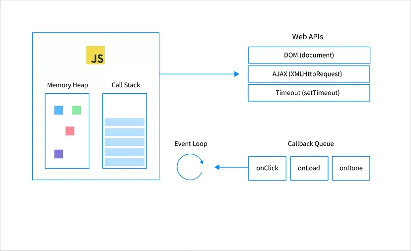

## 자바스크립트의 동등 비교

리액트 컴포넌트가 렌더링할지를 판단하는 방법, 변수와 함수의 메모이제이션 등 모든 작업은 자바스크립트의 동등 비교를 기반으로 하기 때문에 이 부분을 이해하는 것이 중요합니다.

### JS의 데이터 타입

- 원시 타입: `boolean`, `null`, `undefined`, `number`, `string`, `symbol`, `bigint`
- 객체 타입: 그 외의 모든 것

> 객체 타입은 원시 타입과는 다르게, 참조를 전달하기 때문에 내부의 프로퍼티가 동일하다고 해도 선언될 때마다 다른 메모리 주소에 할당된다는 점을 유의해야 합니다.

#### 동등 비교 방법 3가지

##### ==

양쪽이 같은 타입이 아니라면, 강제로 형변환한 뒤 비교합니다.  
ex) `'1' == 1` 의 값은 `true`.

##### ===

타입까지 엄격하게 비교합니다.  
ex) `'1' == 1` 의 값은 `false`.

그러나, Object.is와 비교했을 때 몇 가지 개발자가 기대하지 않는 방식으로 동작하는 부분이 있습니다.

```ts
-0 === +0; // true
Object.is(-0, +0); // false

Number.NaN === NaN; // false
Object.is(Number.NaN, NaN); // true

NaN === 0 / 0; // false
Object.is(NaN, 0 / 0); // true
```

##### Object.is

[Object.is()와 ===의 유일한 차이는 부호 있는 0과 NaN 값들의 처리입니다. (MDN)](https://developer.mozilla.org/ko/docs/Web/JavaScript/Reference/Global_Objects/Object/is#%EC%84%A4%EB%AA%85)

#### 리액트에서의 동등 비교

Object.is는 ES6부터 지원하는 기능이기 때문에, 리액트에서는 하위 호환성을 위해 [폴리필](https://github.com/facebook/react/blob/main/packages/shared/objectIs.js)이 구현되어 있습니다.

```ts
function is(x: any, y: any) {
  return (x === y && (x !== 0 || 1 / x === 1 / y)) || (x !== x && y !== y);
}

const objectIs: (x: any, y: any) => boolean =
  // $FlowFixMe[method-unbinding]
  typeof Object.is === 'function' ? Object.is : is;

export default objectIs;
```

그리고 `objectIs` 함수를 기반으로, 의존성을 비교하는 [shallowEqual](https://github.com/facebook/react/blob/main/packages/shared/shallowEqual.js) 함수가 존재합니다.

```ts
function shallowEqual(objA: mixed, objB: mixed): boolean {
  // Object.is의 결과가 같으면 true.
  if (is(objA, objB)) {
    return true;
  }

  // 둘 중 하나라도 객체가 아니면 false.
  if (
    typeof objA !== 'object' ||
    objA === null ||
    typeof objB !== 'object' ||
    objB === null
  ) {
    return false;
  }

  const keysA = Object.keys(objA);
  const keysB = Object.keys(objB);

  // 두 객체의 프로퍼티 갯수가 다르면 false.
  if (keysA.length !== keysB.length) {
    return false;
  }

  // A의 키를 기준으로, B에 같은 키가 있으며 값이 동일한지 비교.
  for (let i = 0; i < keysA.length; i++) {
    const currentKey = keysA[i];
    if (
      !hasOwnProperty.call(objB, currentKey) ||
      // $FlowFixMe[incompatible-use] lost refinement of `objB`
      !is(objA[currentKey], objB[currentKey])
    ) {
      return false;
    }
  }

  return true;
}
```

위 함수는 두 객체의 프로퍼티를 1단계까지 비교하기 때문에 Object.is와는 달리 객체가 같은지를 비교할 수 있습니다.

```ts
Object.is({ hello: 'world' }, { hello: 'world' }); // false

shallowEqual({ hello: 'world' }, { hello: 'world' }); // true
```

## 함수

함수란 작업을 수행하거나 값을 계산하는 등의 과정을 표현하고, 이를 하나의 블록으로 감싸서 실행 단위로 만들어 놓은 것을 의미합니다.

### 함수 정의 방법 4가지

#### 함수 선언문

함수 선언문으로 정의한 함수의 경우, 함수 호이스팅이 일어납니다.  
(실행 컨텍스트가 생성되는 코드 평가 단계에서 함수로 초기화)

```ts
add(1, 3); // 4

function add(a, b) {
  return a + b;
}
```

#### 함수 표현식

함수 표현식으로 정의한 함수의 경우, 변수 호이스팅이 일어납니다.  
(실행 컨텍스트가 생성되는 코드 평가 단계에서 var의 경우에는 undefined으로, let과 const의 경우에는 식별자 선언만 하고 값이 초기화되지 않음.)

```ts
sum(1, 3); // ReferenceError

const sum = function (a, b) {
  return a + b;
};
```

#### Function 생성자

잘 사용되지 않습니다. (eval만큼이나)

```ts
const add = new Function('a', 'b', 'return a + b');
```

#### 화살표 함수

ES6에 등장한 방법으로, 몇 가지 특징이 존재합니다.

- `this` 값이 바인딩되지 않고, 상위 스코프의 `this` 값을 그대로 활용
- `constructor` 정의가 불가능하므로, `new` 연산자로 호출 불가

```ts
const add = (a, b) => {
  return a + b;
};
```

### 다양한 함수 활용 방법

#### 즉시 실행 함수(IIFE)

함수 선언과 동시에 실행하는 방법입니다.  
한 번 호출된 이후에는 다시 수행되지 않으며, 전역 스코프를 오염시키지 않기 때문에 모듈이 등장하기 전에 모듈처럼 자주 사용했던 방법이기도 합니다.

```ts
(function (a, b) {
  return a + b;
})(10, 24);
```

#### 고차 함수

함수가 일급 객체로 다뤄지는 프로그래밍 언어에서 활용 가능한 방법으로, 함수를 인수로 받고 새로운 함수를 반환합니다.

```ts
const doubledArray = [1, 2, 3].map((item) => item * 2); // [2, 4, 6]
```

> 일급 객체
>
> - 객체를 변수에 담을 수 있어야 함.
> - 객체를 함수의 파라미터로 전달할 수 있어야 함.
> - 객체를 함수의 반환 값으로 사용할 수 있어야 함.

## 클래스

```ts
class Person {
  constructor(name) {
    this.name = name;
  }

  // 프로토타입 메소드
  showName() {
    console.log(`제 이름은 ${this.name} 이에요.`);
  }

  // 정적 메소드
  static sayHello() {
    console.log('안녕하세요 저는 사람이에요.');
  }
}

class Developer extends Person {
  constructor(name) {
    super(name);
    this.job = '개발자';
  }

  showJob() {
    console.log(`제 직업은 ${this.job} 이에요.`);
  }
}

const human1 = new Developer('김철수');

Person.sayHello(); // 안녕하세요 저는 사람이에요.
human1.showName(); // 제 이름은 김철수 이에요.
human1.showJob(); // 제 직업은 개발자 이에요.
```

- **생성자**
  - 객체를 생성하는 데 사용하는 특수한 메소드입니다.
  - `new` 연산자로 클래스를 호출하면, 생성자가 실행됩니다.
  - 만약 상속한 부모 클래스가 있다면, 인스턴스의 생성은 최상위 부모 클래스에서 발생하기 때문에 반드시 `super()` 를 호출해줘야 합니다.
- **프로퍼티**
  - 클래스로 인스턴스를 생성할 때 내부에 정의할 수 있는 속성값입니다.
- **인스턴스 메소드**
  - 모든 인스턴스의 `__proto__` 로 연결되는 프로토타입 객체에 정의되는 메소드로, 클래스 내부에 정의하는 메소드는 기본적으로 인스턴스 메소드입니다.
- **정적 메소드**
  - 클래스 내부에서 `static` 키워드로 정의한 메소드로, 클래스 객체에 정의되는 메소드입니다.
  - 프로토타입 객체에 들어가는 메소드가 아니기 때문에, 각 인스턴스에서 호출할 수는 없습니다.

## 클로저

클로저는 함수를 일급 객체로 다루는 함수형 프로그래밍 언어에서 자주 볼 수 있는 특징으로, 함수와 그 함수가 선언된 어휘적 환경의 조합을 클로저라고 합니다.

아래에서 `init` 함수의 실행 컨텍스트가 제거되었음에도 `displayName` 함수는 여전히 `name` 변수에 접근할 수 있는데 이렇게 `name` 이라는 자유 변수에 엮여 있는 `displayName` 함수를 클로저라고 합니다.

```ts
function init() {
  var name = 'Mozilla'; // name은 init에 의해 생성된 지역 변수이다.

  function displayName() {
    // displayName() 은 내부 함수이며, 클로저다.
    console.log(name); // 부모 함수에서 선언된 변수를 사용한다.
  }

  return displayName;
}

const func = init();
func();
func();
func();
```

다만, 클로저를 활용하는 과정에서 선언적 환경을 메모리에 기록하고 있어야 하기 때문에 메모리를 불필요하게 잡아먹는 문제를 야기할 수 있어서 유의해야 합니다.

```ts
function heavyJobWithClosure() {
  const longArr = Array.from({ length: 10000000 }, (_, i) => i + 1);
  return function () {
    console.log(longArr.length);
  };
}

const innerFunc = heavyJobWithClosure();
```

### useState

`useState` 의 `setState` 함수도 클로저의 원리를 활용한 것입니다.

아래 코드에서 useState 호출은 이미 끝났지만, `handleClick` 함수에서 사용하는 `setState` 가 최신 값을 계속 기억하고 있는 이유는 `useState` 가 내부적으로 클로저를 사용하고 있기 때문입니다.

```ts
function Component() {
  const [state, setState] = useState(0);

  function handleClick() {
    setState((prev) => prev + 1);
    setState((prev) => prev + 1);
    setState((prev) => prev + 1);
  }
}
```

리액트 소스코드를 살펴보면, 컴포넌트가 마운트될 때 `useState` 가 호출된 곳에서 `mountState` 가 호출된 뒤 반환되는데, 반환 값의 두 번째 인자로 `dispatch` 함수를 보내고 있습니다.

그런데 `dispatch` 함수는 외부의 `hook` 자유변수에 의존하고 있는데, `mountState` 보다 오랜 생명주기를 가지고 있으므로 클로저라고 할 수 있습니다.

```ts
function mountState<S>(
  initialState: (() => S) | S,
): [S, Dispatch<BasicStateAction<S>>] {
  const hook = mountWorkInProgressHook();

  if (typeof initialState === 'function') {
    initialState = initialState();
  }

  hook.memoizedState = hook.baseState = initialState;

  const queue = (hook.queue = {
    last: null,
    dispatch: null,
    lastRenderedReducer: basicStateReducer,
    lastRenderedState: (initialState: any),
  });

  const dispatch: Dispatch<
    BasicStateAction<S>,
  > = (queue.dispatch = (dispatchAction.bind(
    null,
    // Flow doesn't know this is non-null, but we do.
    ((currentlyRenderingFiber: any): Fiber),
    queue,
  ): any));

  return [hook.memoizedState, dispatch];
}
```

## 이벤트 루프와 비동기 통신의 이해

이벤트 루프는 싱글 스레드로 동작하는 JS에서, 비동기 작업을 JS 런타임 외부로 위임하는 방식으로 비동기 처리를 지원하는 장치입니다.

### 프로세스와 스레드

- 프로그램: 어떤 작업을 수행하기 위한 명령어의 집합으로, 저장 장치에 파일로 저장되어 있는 상태
- 프로세스: 프로그램이 실행되어 메모리에 적재되고, CPU 자원을 할당받아 실행되고 있는 상태
- 스레드: 하나의 프로세스 내에서 동시에 진행할 수 있는 실행 단위

> JS 엔진은 단 하나의 콜 스택만 갖고 있기 때문에, 단일 스레드로 동작합니다.

#### 프로세스 vs 스레드 From. ChatGPT

**프로세스(Process):**

- 프로세스는 운영체제에서 **실행되는 프로그램의 인스턴스**입니다.
- 각 프로세스는 자신의 주소 공간, 자원(메모리, CPU 시간, 파일, 네트워크 등)을 독립적으로 가지고 있습니다.
- 각 프로세스는 별도의 메모리 공간을 할당받아야 하므로 프로세스 간의 통신(Inter-Process Communication, IPC)이 필요합니다.
- 프로세스는 다른 프로세스의 영향을 받지 않고 독립적으로 실행됩니다.

**스레드(Thread):**

- 스레드는 **프로세스 내에서 실행되는 실행의 단위**입니다.
- 한 프로세스 내에서 여러 개의 스레드가 동시에 실행될 수 있습니다.
- 스레드는 프로세스 내의 자원을 공유하며, 프로세스의 주소 공간을 공유합니다. 따라서 스레드 간의 통신(Inter-Thread Communication)이 간단합니다.
- 스레드는 프로세스 내의 코드, 데이터, 힙 영역을 공유하기 때문에, 스레드 간의 데이터 공유나 통신은 프로세스 간의 것보다 더 빠르게 이루어질 수 있습니다.
- 스레드는 독립적인 실행 흐름을 가지지만, 한 프로세스의 스레드가 다른 스레드에 영향을 줄 수 있습니다. 따라서 스레드 간의 동기화가 필요할 수 있습니다.

요약하면, 프로세스는 실행 중인 프로그램의 인스턴스이며, 각각이 독립적인 주소 공간과 자원을 가지고 있습니다. 반면에 스레드는 프로세스 내에서 실행되는 실행 단위로, **같은 프로세스 내의 스레드들은 주소 공간을 공유하고 서로 영향**을 줄 수 있습니다.

> 스레드는 프로세스에 비해 Context Switching을 위한 오버 헤드가 적기 때문에 병렬 작업을 효율적으로 할 수 있지만, 프로세스 내의 같은 자원을 공유하기 때문에 여러 스레드가 같은 자원을 동시에 접근하는 동시성 문제를 유의해야 한다고 합니다.

### JS 동작 원리

- 함수가 호출되면, 실행 컨텍스트가 생성되어 호출 스택에 `push` 됩니다.
- 함수가 종료되면, 호출 스택의 최상위에 존재하는 실행 컨텍스트가 `pop` 되고 실행됩니다.
- `setTimeout`, `Promise` 등의 비동기 작업이 호출 스택에서 `pop` 되는 경우, 비동기 작업을 `WebAPI` 에 위임합니다.
  - `NodeJS` 환경에서는 `libuv` 에게 위임합니다.
- 비동기 작업이 완료되면, 완료 시 동작해야 할 콜백 함수가 큐에 `push` 됩니다.
- 이벤트 루프는 주기적으로 호출 스택이 비어있는지 체크하고, 비어있다면 우선순위가 높은 콜백 함수부터 호출 스택에 넣어줍니다.

> 완료 시 태스크 큐에 들어가는 작업: **setTimeout**, setInterval, setImmediate
> 완료 시 마이크로 태스크 큐에 들어가는 작업: **Promise**, process.nextTick, queueMicroTask, MutationObserver

우선순위: 마이크로 태스크 큐 > 애니메이션 프레임 > 태스크 큐



#### 동작 예시

```ts
function bar() {
  console.log('bar');
}

function baz() {
  console.log('baz');
}

function foo() {
  console.log('foo');
  setTimeout(bar(), 0);
  baz();
}

foo();
```

1. `foo()` 가 호출 스택에 먼저 들어간다.
2. `foo()` 내부에 `console.log` 가 존재하므로 호출 스택에 들어간다.
3. 2의 실행이 완료된 이후에 다음 코드로 넘어간다. (아직 `foo()` 는 존재)
4. `setTimeout(bar(), 0)` 이 호출 스택에 들어간다.
5. 4번에 대해 타이머 이벤트가 실행되며 태스크 큐로 들어가고, 그 대신 바로 스택에서 제거된다.
6. `baz()` 가 호출 스택에 들어간다.
7. `baz()` 내부에 `console.log` 가 존재하므로 호출 스택에 들어간다.
8. 7의 실행이 완료된 이후에 다음 코드로 넘어간다. (아직 `foo()`, `baz()` 는 존재)
9. 더 이상 `baz()` 에 남은 것이 없으므로 호출 스택에서 제거된다. (아직 `foo()` 는 존재)
10. 더 이상 `foo()` 에 남은 것이 없으므로 호출 스택에서 제거된다.
11. 이제 호출 스택에 완전히 비워졌다.
12. 이벤트 루프가 호출 스택이 비워져 있다는 것을 확인했다. 그리고 태스크 큐를 확인하니 4번에 들어갔던 내용이 있어 `bar()` 를 호출 스택에 들여보낸다.
13. `bar()` 내부에 `console.log` 가 존재하므로 호출 스택에 들어간다.
14. 13의 실행이 끝나고, 다음 코드로 넘어간다. (아직 `bar()` 존재)
15. 더 이상 `bar()`에 남은 것이 없으므로 호출 스택에서 제거된다.

## 자주 사용되는 JS 문법

### 배열 구조 분해 할당

배열의 값을 해체하고, 개별 변수에 새로운 값을 할당하는 문법입니다.
`useState`, `useReducer` 와 같은 훅에서도 많이 사용되는 방식입니다.

```ts
let a, b, rest;

[a, b] = [10, 20];
[a, b, ...rest] = [10, 20, 30, 40, 50];

console.log(a);
// Expected output: 10
console.log(b);
// Expected output: 20
console.log(rest);
// Expected output: Array [30, 40, 50]
```

### 객체 구조 분해 할당

객체의 속성을 해체하고, 개별 변수에 새로운 값을 할당하는 문법입니다.

```ts
({ a, b } = { a: 10, b: 20 });
console.log(a); // 10
console.log(b); // 20
```

### 전개 구문

객체나 배열 내부에 들어있는 프로퍼티 혹은 값을 복사하고 확장할 수 있습니다.

```ts
const obj1 = {
  a: 1,
  b: 2,
};

const obj2 = {
  c: 3,
  d: 4,
};

const newObj = { ...obj1, ...obj2 };
// { "a": 1, "b": 2, "c": 3, "d": 4, }
```

```ts
var arr = [1, 2, 3];
var arr2 = [...arr]; // arr.slice() 와 유사
arr2.push(4);

// arr2 은 [1, 2, 3, 4] 이 됨
// arr 은 영향을 받지 않고 남아 있음
```

### 객체 초기자

ES2015에서 도입된 문법으로, 객체에 넣고자 하는 키와 값을 가지고 있는 변수가 이미 존재한다면 축약해서 선언할 수 있습니다.

```ts
const a = 1;
const b = 2;

const obj = {
  a,
  b,
};
// { a: 1, b: 2 }
```

### Array 프로토타입 메소드

#### map

배열 내의 모든 요소 각각에 대하여 주어진 함수를 호출한 결과를 모아 새로운 배열을 반환합니다.

```ts
const array1 = [1, 4, 9, 16];

// Pass a function to map
const map1 = array1.map((x) => x * 2);

console.log(map1);
// Expected output: Array [2, 8, 18, 32]
```

#### filter

배열에서 특정 조건을 만족하는 요소만 추출하여 새로운 배열을 반환합니다.

```ts
const words = ['spray', 'elite', 'exuberant', 'destruction', 'present'];

const result = words.filter((word) => word.length > 6);

console.log(result);
// Expected output: Array ["exuberant", "destruction", "present"]
```

#### reduce

배열을 순회하면서 값을 누적하고 하나의 결과 값을 반환합니다.

```ts
const array1 = [1, 2, 3, 4];

// 0 + 1 + 2 + 3 + 4
const initialValue = 0;
const sumWithInitial = array1.reduce(
  (accumulator, currentValue) => accumulator + currentValue,
  initialValue
);

console.log(sumWithInitial);
// Expected output: 10
```

#### forEach

배열을 순회하면서 각 요소에 대해서 콜백 함수를 실행합니다.

```ts
const array1 = ['a', 'b', 'c'];

array1.forEach((element) => console.log(element));

// Expected output: "a"
// Expected output: "b"
// Expected output: "c"
```

#### 삼항 조건 연산자

조건이 truthy하면 왼쪽의 피연산자를, falsy하면 오른쪽의 피연산자를 할당합니다.

```ts
function getFee(isMember) {
  return isMember ? '$2.00' : '$10.00';
}

console.log(getFee(true));
// Expected output: "$2.00"

console.log(getFee(false));
// Expected output: "$10.00"

console.log(getFee(null));
// Expected output: "$10.00"
```

> 💡 falsy한 값
> null, undefined, false, NaN, 0, -0, 0n, "", document.all 등

## 타입스크립트

### 타입스크립트란?

자바스크립트는 기본적으로 식별자의 자료형을 런타임에서 변경할 수 있는 동적 타입의 특징을 가진 언어인데요. 그렇다보니 프로젝트의 규모가 커질수록 개발자의 실수로 변수에 할당되는 값의 타입이 달라져서 예상치 못한 오류가 발생할 가능성이 존재합니다. 타입스크립트는 자바스크립트의 슈퍼셋 언어로, 빌드 단계에서 타입스크립트로 작성된 문법을 자바스크립트로 변환하는 과정을 거치게 됩니다. 이 과정에서 각 식별자에 들어갈 수 있는 값의 타입을 미리 체크하여 예상치 못한 동작을 방지할 수 있습니다.

> 타입스크립트를 사용해도 빌드 타임에 체크하지 못하는 값에 대해서는 `zod`와 같은 유효성 검사 라이브러리로 런타임에서 체크하는 방법을 사용하기도 합니다. ex) 폼 데이터 유효성 검사

#### any 대신 unknown 사용하기

any를 사용하는 경우 정적 타이핑의 장점을 모두 버리는 것이나 다름 없으므로, 가능하다면 unknown을 사용하는 것이 좋습니다.

```ts
function doSomething(callback: any) {
  callback();
}

doSomething(1);
// 함수 형태의 인자를 예상했지만, 숫자가 들어오고 있다.
// 그럼에도 타입스크립트에서 에러가 발생하지 않는 것이 문제이다.
```

unknown을 사용하고 필요한 타입 가드를 작성하는 것이 좋습니다.

```ts
function doSomething(callback: unknown) {
  if (typeof callback === 'function') {
    callback();
    return;
  }

  throw new Error('callback은 함수여야 합니다');
}
```

#### 타입 가드를 적극 활용하기

타입스크립트는 객체의 타입을 결정하는 데 있어서 덕 타이핑을 사용합니다.  
따라서 `instanceof`, `typeof` 와 같은 연산자를 통해 사용하는 측에서 타입을 최대한 좁히는 것이 좋습니다.

> 덕 타이핑(Duck Typing)
> 실제로는 오리가 아니어도, 오리처럼 행동하고 꽥꽥 소리를 낸다면 오리 타입으로 인정해주는 것

##### typeof

```ts
function doSomething(x: number | string) {
  if (typeof x === 'string') {
    // TypeScript는 이 조건문 블록 안에 있는 `x`는 백퍼 `string`이란 걸 알고 있습니다.
    console.log(x.subtr(1)); // Error: `subtr`은 `string`에 존재하지 않는 메소드입니다.
    console.log(x.substr(1)); // ㅇㅋ
  }
  x.substr(1); // Error: `x`가 `string`이라는 보장이 없죠.
}
```

##### instanceof

```ts
class Foo {
  foo = 123;
  common = '123';
}

class Bar {
  bar = 123;
  common = '123';
}

function doStuff(arg: Foo | Bar) {
  if (arg instanceof Foo) {
    console.log(arg.foo); // ㅇㅋ
    console.log(arg.bar); // Error!
  }
  if (arg instanceof Bar) {
    console.log(arg.foo); // Error!
    console.log(arg.bar); // ㅇㅋ
  }

  console.log(arg.common); // ㅇㅋ
  console.log(arg.foo); // Error!
  console.log(arg.bar); // Error!
}

doStuff(new Foo());
doStuff(new Bar());
```

##### in

```ts
interface A {
  x: number;
}
interface B {
  y: string;
}

function doStuff(q: A | B) {
  if ('x' in q) {
    // q: A
  } else {
    // q: B
  }
}
```

[코드 출처](https://radlohead.gitbook.io/typescript-deep-dive/type-system/typeguard)

#### 제네릭

제네릭은 타입을 선언 시점에 결정하는 것이 아니라, 제네릭 인자를 전달하여 사용되는 시점에 결정하여 다양한 타입에 대응하는 기법입니다.

```ts
class Queue<T> {
  protected data: Array<T> = [];
  push(item: T) {
    this.data.push(item);
  }
  pop(): T | undefined {
    return this.data.shift();
  }
}

// number 전용 Queue
const numberQueue = new Queue<number>();

numberQueue.push(0);
// numberQueue.push('1'); // 의도하지 않은 실수를 사전 검출 가능
numberQueue.push(+'1'); // 실수를 사전 인지하고 수정할 수 있다

// ?. => optional chaining
// https://www.typescriptlang.org/docs/handbook/release-notes/typescript-3-7.html#optional-chaining
console.log(numberQueue.pop()?.toFixed()); // 0
console.log(numberQueue.pop()?.toFixed()); // 1
console.log(numberQueue.pop()?.toFixed()); // undefined

// string 전용 Queue
const stringQueue = new Queue<string>();

stringQueue.push('Hello');
stringQueue.push('World');

console.log(stringQueue.pop()?.toUpperCase()); // HELLO
console.log(stringQueue.pop()?.toUpperCase()); // WORLD
console.log(stringQueue.pop()?.toUpperCase()); // undefined

// 커스텀 객체 전용 Queue
const myQueue = new Queue<{ name: string; age: number }>();
myQueue.push({ name: 'Lee', age: 10 });
myQueue.push({ name: 'Kim', age: 20 });

console.log(myQueue.pop()); // { name: 'Lee', age: 10 }
console.log(myQueue.pop()); // { name: 'Kim', age: 20 }
console.log(myQueue.pop()); // undefined
```

[코드 출처](https://poiemaweb.com/typescript-generic#:~:text=%EC%A0%9C%EB%84%A4%EB%A6%AD%EC%9D%80%20%EC%84%A0%EC%96%B8%20%EC%8B%9C%EC%A0%90%EC%9D%B4,%EA%B0%80%EB%8A%A5%ED%95%98%EB%8B%A4%EB%8A%94%20%EC%9E%A5%EC%A0%90%EC%9D%B4%20%EC%9E%88%EB%8B%A4)

#### 인덱스 시그니처

인덱스 시그니처는 객체의 인덱스로 들어올 수 있는 값의 형식을 의미합니다.  
예를 들어 인덱스 시그니처를 `[index: string]` 로 지정하면, 키는 반드시 문자열이어야 합니다.

```ts
let foo: { [index: number]: { message: string } } = {};

/** Ok */
foo[0] = { message: 'some message' };
/** 오류 */
foo['a'] = { message: 'some message' };
```

만약, 인덱스로 들어올 수 있는 요소를 `'a' | 'b' | 'c'` 로 지정하고 싶다면 아래와 같이 할 수 있습니다.

```ts
type Index = 'a' | 'b' | 'c';
type FromIndex = { [k in Index]?: number };

const good: FromIndex = { b: 1, c: 2 };

// 오류:
// 타입 '{ b: number; c: number; d: number; }'은 타입 'FromIndex'에 할당 불가능.
// 객체 리터럴은 알려진 속성만 지정할 수 있고 'd'는 'FromIndex' 타입에 존재하지 않음.
const bad: FromIndex = { b: 1, c: 2, d: 3 };
```

[코드 출처](https://radlohead.gitbook.io/typescript-deep-dive/type-system/index-signatures)

#### 함수 시그니처

함수 시그니처는 함수의 매개변수와 반환 값의 형태를 의미합니다.

```ts
type DescribableFunction = {
  description: string;
  (someArg: number): boolean;
};

function doSomething(fn: DescribableFunction) {
  console.log(fn.description + ' returned ' + fn(6));
}

function myFunc(someArg: number) {
  return someArg > 3;
}
myFunc.description = 'default description';

doSomething(myFunc);
```

[코드 출처](https://www.typescriptlang.org/docs/handbook/2/functions.html#call-signatures)

## References

https://poiemaweb.com/js-closure  
https://radlohead.gitbook.io/typescript-deep-dive/type-system/typeguard  
https://www.tcpschool.com/cpp/cpp_cppFunction_overloading  
https://goidle.github.io/react/in-depth-react-hooks_1/  
https://inpa.tistory.com/entry/%F0%9F%91%A9%E2%80%8D%F0%9F%92%BB-%ED%94%84%EB%A1%9C%EC%84%B8%EC%8A%A4-%E2%9A%94%EF%B8%8F-%EC%93%B0%EB%A0%88%EB%93%9C-%EC%B0%A8%EC%9D%B4  
https://medium.com/@kamaleshs48/event-loop-in-javascript-c332b0f81b1e
