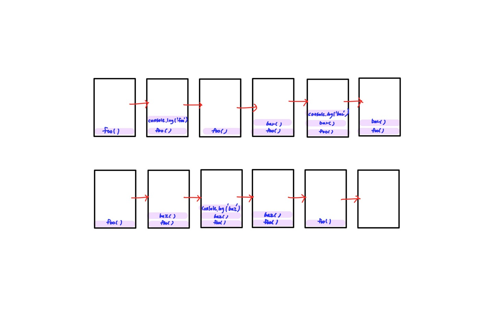
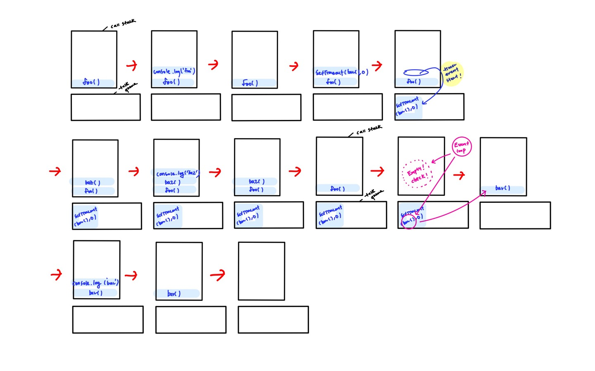

### 🔗 1.5.1 싱글 스레드 자바스크립트

- JS는 싱글 스레드 언어이다.

  - 프로세스 : 프로그램을 구동해 프로그램의 상태가 메모리상에서 실행되는 **작업 단위**를 의미한다. 프로그램에는 하나의 프로세스만이 할당된다.
  - 스레드 : 더 작은 실행 단위이다. 하나의 프로세스에서는 여러 개의 스레드를 만들 수 있다. 스레드끼리는 메모리를 공유할 수 있어 여러 가지 작업을 동시에 수행할 수 있다. 이로 인해 프로세스 내부에서 여러개의 스레드를 활용하면서 동시 다발적인 작업을 처리할 수 있다.

  - 왜 JS는 싱글 스레드로 설계됐을까?

    - JS를 만들 당시에는 멀티 스레드란 용어가 대중화 돼있지 않을 뿐더러 현재와 같이 JS를 가지고 웹페이지에서 다양한 일을 처리하게 될지 몰랐다. 또한 아래와 같은 멀티 스레드의 단점이 있었다.
    - 멀티 스레드의 단점
      - 스레드는 하나의 프로세스에서 동시에 서로 다른 자원에 접근할 수 있어 동시성 문제가 발생할 수 있다. (이는 브라우저의 DOM 표시에 큰 문제를 야기할 수 있다.) 또한 하나의 스레드가 문제가 생기면 같은 자원을 공유하는 다른 스레드에도 동시에 문제가 일어날 수 있다.
    - JS가 싱글 스레드라는 것은 JS 코드의 실행이 하나의 스레드에서 순차적으로 이루어지는 것을 의미한다.(동기적) 하나의 작업이 끝나기 전까지 뒤이은 작업이 실행되지 않는다.

      - 이로 인해 동시성을 고민할 필요가 없다는 아주 큰 장점이 되지만 웹페이지에서는 하나의 작업이 끝나기 전까지는 다른 작업이 실행되지 않으므로 사용자에게 웹페에지가 멈춘 것 같은 느낌을 줄 수 있는 단점이 된다.
      - 비동기 : 요청한 즉시 결과가 주어지지 않을 수도 있고, 따라서 응답이 언제 올지도 알 수 없다. 여러 작업을 동시에 수행할 수 있다는 장점이 있다. JS에서 비동기 함수를 선언할 떄 `async`를 쓴다.

      ```
      // 싱글 스레드로 작동하기 때문에 1, 2, (0.1초 후에)3, 4로 출력될거라 생각하지만 1, 4, 2, 3으로 나타난다. 동기식으로 작동하는 JS 세상에서 어떻게 이런 비동기 코드를 처리할 수 있는 이유는 '이벤트 루프' 덕분이다.

      console.log(1)

      setTimeout(() => {
        console.log(2)
      }, 0)

      setTimeout(() => {
        console.log(3)
      }, 100)

      console.log(4)
      ```

### 🔗 1.5.2 이벤트 루프란?

> JS 런타임 엔진 중에서 가장 유명한 V8을 기준으로 작성됐다.
> 이벤트 루프란 JS 런타임 외부에서 JS의 비동기 실행을 돕기 위해 만들어진 장치이다.

### 호출 스택 (call stack)

JavaScript에서 수행해야 할 코드나 함수를 순차적으로 담아두는 스택이다.

```
function bar() {
  console.log('bar')
}

function baz() {
  console.log('baz')
}

function foo() {
  console.log('foo')
  bar()
  baz()
}

foo()
```

- 콜 스택 시각화
  
- 비동기 작업 콜 스택 & 태스크 큐 시각화

```
function bar() {
  console.log('bar')
}

function baz() {
  console.log('baz')
}

function foo() {
  console.log('foo')
  setTimeout(bar(), 0)
  baz()
}

foo()
```

  

### 이벤트 루프 (Event loop)

- 이벤트 루프의 역할

  1. 호출 스택에 실행 중인 코드가 있는지 확인
  2. 호출 스택이 비었다면 태스크 큐에 대기 중인 작업이 있는지 확인
  3. 콜 스택이 비어 있는지 확인되면 태스크 큐에 대기 중인 작업이 있는지 확인
  4. 태스크 큐에 대기 중인 작업이 있다면 실행 가능한 오래된 것부터 순차적으로 꺼내와서 호출 스택에 넣어 실행시킴 (동일하게 태스크 큐가 빌 떄까지 이루어진다.)

- **코드를 실행하는 것**과 **호출 스택이 비어있는지 확인하는 것** 모두가 단일 스레드에서 일어난다.
  - 즉, 두 작업은 동시에 일어날 수 없으며 한 스레드에서 순차적으로 일어난다.
  - **코드를 실행시키는 것**은 자바스크립트 엔진이 수행한다.

### 태스크 큐

- 실행해야 할 태스크의 집합
- 이벤트 루프는 이러한 태스크 큐를 한 개 이상 가지고 있다.
- 큐가 아닌 set 형태로 **실행 가능한 가장 오래된 태스크**를 가져온다.
  - **실행 가능한 가장 오래된 태스크** : 비동기 함수의 콜백 함수, 이벤트 핸들러 등

### 🔗 1.5.3 테스크 큐와 마이크로 테스크 큐

이벤트 루프는 하나의 마이크로 태스크 큐를 갖는다.

- 태스크 큐 : setTimeout, setInterval, setImmediate
- 마이크로 태스크 큐 : process.nextTick, Promises, queueMicroTask, MutationObserver

마이크로 태스크 큐는 기존 태스크 큐보다 우선권을 갖는다. 마이크로 태스크 큐가 빌 때까지는 기존 태스크 큐의 실행은 뒤로 미뤄진다. 즉, setTimeout은 Promise 보다 늦게 실행된다.

- 렌더링은 언제 실행될까?
  - 마이크로 태스크 큐 작업이 끝날 때마다 한 번씩 렌더링할 기회를 얻는다.
  - 마이크로 태스크 큐 작업1 => 렌더링 => 마이크로 태스크 큐 작업2 => 렌더링 => 마이크로 태스크 큐 작업3 => 렌더링

#### [코드 1.12] 동기 코드, 태스크 큐, 마이크로 태스크 큐와 렌더링과의 관계를 확인할 수 있는 코드

#### 아래 함수의 실행 결과를 예측해 보기

1. 콜 스택 안에 작업이 먼저 이루어진다.
2. 마이크로 테스크 큐의 작업이 끝날 때 까지 진행된다.
3. 테스크 큐의 작업이 끝날 때 까지 진행된다.

```
function timer(i) {
  let start = i;

  // callback 함수
  const callback = (i) => { // 1
    setTimeout(() => { // 2
      Promise.resolve().then(() => { // 3
        console.log(`--${i}--`);
      });

      setTimeout(() => { // 4
        console.log(`-${i}-`);
      });

      console.log(`---${i}---`); // 5
    }, (start - i) * 1000);
  };

  // 반복문
  for (let j = 0; j <= i; j += 1) {
    callback(j);
  }
}

timer(5);
```
