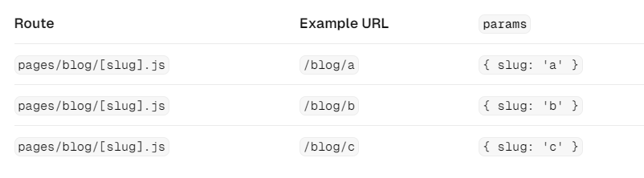
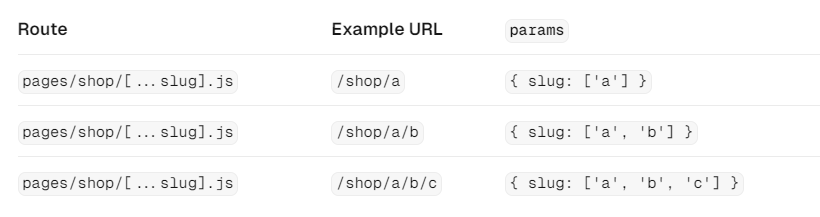
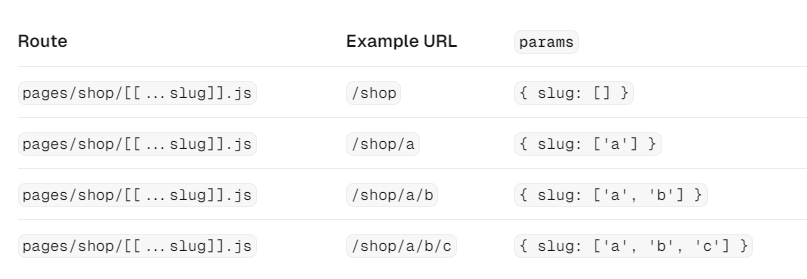

# SPA VS MPA

**SPA**

- 웹 서버에 최초로 HTML 파일을 요청한 이후에는, 렌더링과 라우팅이 모두 클라이언트 단에서 발생하는 방식입니다.
- 사용자 인터랙션으로 인한 페이지 전환이 빠릅니다. (새로운 페이지를 네트워크 요청으로 가져올 필요가 없기 때문)

**MPA**

- 페이지 전환이 발생할 때마다 웹 서버에 새로운 HTML 파일을 요청하는 방식입니다.
- 페이지 별 메타태그를 적용하기 쉽고, 서버측에서 미리 넣어놓기 때문에 SEO에 강합니다.
- 하나의 페이지에서 계속해서 상태를 관리하는 SPA에 비해 memory leak이 발생할 가능성이 비교적 낮습니다.
- 모든 JS 번들 파일을 가져와야 렌더링을 시작하는 SPA에 비해서 최초로 화면이 보이는 FCP가 비교적 빠릅니다.

### SPA의 유행과 JAM 스택의 등장

- 페이지 전환마다 잠시 하얀 화면을 보게 되는 MPA와는 다르게, 즉각적인 사용자 경험을 줄 수 있는 SPA가 점차 활발하게 채택되고 있었습니다.
- PHP나 JSP 기반의 MPA 방식을 주로 사용했을 때, JS는 어디까지나 사용자에게 추가적인 경험을 주기 위한 보조적인 수단으로 활용되었으나, 점차 다양한 작업을 수행하게 되면서 CommonJS, AMD와 같은 모듈 시스템이 제안되었고 결국 ES6에는 ESM이 도입되었습니다.
- 2010년경 BackBone.js, AngularJS, Knockout.js 가 등장하면서 프론트엔드에서도 MV\* 패턴이 도입되기 시작했고, JS의 역할과 규모가 커져가고 있었습니다.
- 이후 React, Vue와 같은 라이브러리 및 프레임워크가 등장하면서 현재 프론트엔드의 대세를 이끌어가고 있습니다.

<aside>
💡 LAMP 스택: Linux + Apache + MySQL + PHP/Python (전통적인 MPA 방식)  
JAM 스택: JavaScript + API + Markup  
MEAN 스택: MongoDB + Express + Angular + Node.js  
**MERN 스택**: MongoDB + Express + React + Node.js

</aside>

### SSR의 장점

- 최초 페이지 진입이 비교적 빠릅니다. (FCP가 빠름)
- SEO에 강하고, SNS 공유 등의 메타데이터 제공이 쉽습니다.
  - 페이지 별 다른 메타데이터 제공 가능.
- 누적 레이아웃 이동이 적습니다. (CLS 감소)
  - 데이터를 API 요청으로 가져온 뒤 다시 화면을 업데이트 해야 하는 CSR에 비해서
- 사용자의 디바이스 성능에 비교적 자유롭습니다.
  - 그러나 서버가 렌더링 부담을 하고 있기에, 트래픽에 따른 서버 스케일링 등의 적절한 작업이 필요.
- 보안에 더 안전합니다.
  - 인증과 같은 민감한 작업을 서버에서 수행하고 결과만 브라우저에게 전달하는 방식이 가능함.

### SSR의 단점

- 소스코드를 작성할 때 서버를 항상 고려해야 합니다.
  - 서버 환경에서는 브라우저의 API를 사용할 수 없고, useLayoutEffect와 같은 훅도 사용할 수 없음.
- 적절한 서버가 구축되어 있어야 합니다.
  - 사용자의 요청에 따라서 적절하게 scale-up 하는 등의 작업이 필요하고, 예상치 못한 장애 상황 발생시 관리해야 할 지점이 늘어남.

<aside>
💡 **현대의 SSR**
모든 페이지를 서버에서 렌더링하는 전통적인 LAMP 스택과는 다르게, Next.js, Remix와 같이 현재 곽광받는 SSR 지원 프레임워크는 최초 페이지 진입만 SSR 방식으로 어느정도 완성된 화면을 가져오고, 이후 라우팅에서는 SPA 처럼 동작하여 CSR과 SSR의 두 장점 모두 취한 방식을 채택합니다.

</aside>

### SSR을 위한 리액트 API

- [renderToString](https://ko.react.dev/reference/react-dom/server/renderToString): React 트리를 HTML 문자열로 렌더링합니다.
- [renderToStaticMarkup](https://ko.react.dev/reference/react-dom/server/renderToStaticMarkup): 상호작용 하지 않는 React 트리를 HTML 문자열로 렌더링합니다. (hydration이 발생하지 않음!)
- [renderToNodeStream](https://ko.react.dev/reference/react-dom/server/renderToNodeStream): React 트리를 [Readable Node.js Stream](https://nodejs.org/api/stream.html) 으로 변환하는데, deprecated되어서 [renderToPipeableStream](https://ko.react.dev/reference/react-dom/server/renderToPipeableStream) 사용을 권장한다고 합니다.
  또한, 이 메소드는 Node.js 에서만 동작하므로, Deno나 최신 엣지 런타임처럼 [Web Stream](https://developer.mozilla.org/ko/docs/Web/API/Streams_API) 이 존재하는 환경인 경우에는 [renderToReadableStream](https://ko.react.dev/reference/react-dom/server/renderToReadableStream) 을 사용해야 한다고 합니다.
- [renderToStaticNodeStream](https://ko.react.dev/reference/react-dom/server/renderToStaticNodeStream): 상호작용 하지 않는 React 트리를 [Readable Node.js Stream](https://nodejs.org/api/stream.html) 으로 렌더링합니다. (hydration이 발생하지 않음!)
- [hydrateRoot](https://ko.react.dev/reference/react-dom/client/hydrateRoot): 서버 환경에서 미리 만들어진 HTML의 DOM 노드 내부에 이벤트 핸들러나 훅과 같은 요소를 넣는 등 React 컴포넌트를 렌더링합니다. (기존 [hydrate](https://ko.react.dev/reference/react-dom/hydrate)를 사용하면 리액트 17 버전처럼 동작하고, 동시성 렌더링을 지원하지 않으므로 주의!)

# Next.js

## Routing

### [pages/\_app.tsx](https://nextjs.org/docs/pages/building-your-application/routing/custom-app)

- 애플리케이션에서 전체 페이지의 시작점입니다. 보통 아래의 용도로 사용됩니다.
  - ErrorBoundary를 활용하여 전역에서 발생하는 에러 핸들링
  - reset.css 같은 전역 CSS 선언
  - 전체 페이지에서 공통으로 사용되는 데이터 제공
- 최초에는 서버 환경에서 렌더링되고, 이후에 페이지 전환이 발생하면 클라이언트 환경에서 리렌더링됩니다.

### [pages/\_document.tsx](https://nextjs.org/docs/pages/building-your-application/routing/custom-document)

- 무조건 서버에서만 실행됩니다.
- html, body 태그 내부를 수정하고 싶을 때 사용합니다.
- CSS-in-JS의 스타일을 서버에서 모아서 HTML로 제공하는 데 사용되기도 합니다.
- 예시

  ```jsx
  import { Html, Head, Main, NextScript } from 'next/document';

  export default function Document() {
    return (
      <Html lang="en">
        <Head />
        <body>
          <Main />
          <NextScript />
        </body>
      </Html>
    );
  }
  ```

### [pages/\_error.tsx](https://nextjs.org/docs/pages/building-your-application/routing/custom-error)

- 클라이언트에서 발생하는 에러와, 서버에서 발생하는 500 에러를 핸들링하기 위한 용도로 사용됩니다.

### pages/404.tsx

- 존재하지 않는 페이지에 대한 에러를 핸들링하기 위한 용도로 사용됩니다.

```jsx
export default function Custom404() {
  return <h1>404 - Page Not Found</h1>;
}
```

### pages/500.tsx

- 서버에서 발생한 에러를 핸들링하기 위한 용도로 사용됩니다.
- 만약 \_error.tsx와 500.tsx가 동시에 존재한다면, 500.tsx가 우선적으로 실행됩니다.

```jsx
export default function Custom500() {
  return <h1>500 - Server-side error occurred</h1>;
}
```

### [pages/index.tsx](https://nextjs.org/docs/pages/building-your-application/routing/pages-and-layouts)

- 특정 path에 접근했을 때 보여줄 페이지를 나타냅니다.
  - pages/index.js → `/`
  - pages/blog/index.js → `/blog`
- 디렉토리 명이 아닌 파일 명도 자유롭게 작성하면, path에 반영됩니다.
  - pages/blog/first-post.js → `/blog/first-post`
  - pages/dashboard/settings/username.js → `/dashboard/settings/username`
- `[slug]` 를 통해 동적 경로를 부여할 수 있습니다.



https://nextjs.org/docs/pages/building-your-application/routing/dynamic-routes

- `[...slug]` 를 통해 동적 경로에 들어갈 path 를 다중으로 부여할 수 있습니다.



https://nextjs.org/docs/pages/building-your-application/routing/dynamic-routes

- `[[...slug]]` 를 통해 동적 경로에 들어갈 path를 Optional하게 다중으로 부여할 수 있습니다.



https://nextjs.org/docs/pages/building-your-application/routing/dynamic-routes

### [pages/api/hello.ts](https://nextjs.org/docs/pages/building-your-application/routing/api-routes)

- API Route 기능으로, 특정 path에 ajax 요청했을 때의 응답을 페이지가 아니라 JSON 형태의 응답을 받고자 할 때 사용합니다.
- BFF 형태로 활용하거나, 풀스택 애플리케이션을 구현하고자 하거나, CORS 문제를 우회하려고 할 때 사용할 수 있습니다.

```jsx
import type { NextApiRequest, NextApiResponse } from 'next';

type ResponseData = {
  message: string,
};

export default function handler(
  req: NextApiRequest,
  res: NextApiResponse<ResponseData>
) {
  res.status(200).json({ message: 'Hello from Next.js!' });
}
```

## Data Fetching

- Next.js에서는 SSR 지원을 위한 몇 가지 데이터 패칭 전략을 지원합니다. (SSR, SSG, ISG 등)

### **[getStaticPaths](https://nextjs.org/docs/pages/api-reference/functions/get-static-paths), [getStaticProps](https://nextjs.org/docs/pages/building-your-application/data-fetching/get-static-props)**

- CMS, 블로그 등 정적 컨텐츠를 위한 데이터를 가져올 때 사용하는 기능으로, 두 개의 함수는 **반드시 함께 사용**해야 합니다.
- 빌드 타임에 수행됩니다. (SSG)
  - **getStaticPaths**
    - paths: 어떤 동적 경로를 pre-rendering할 것인지를 결정합니다. 아래 예시 코드에서는 `pages/posts/1`, `pages/posts/2` 경로를 pre-rendering 합니다.
    - fallback
      - true: 사용자가 아직 빌드되지 않은 페이지에 접근하는 경우 fallback 컴포넌트를 보여줍니다.
      - false: 등록되지 않은 path에 접근하는 경우 404 페이지를 보여주도록 합니다.
      - blocking: 별도의 로딩 처리를 하지 않고, 빌드가 완료될 때까지 사용자가 기다리게 합니다.
  - **getStaticProps**
    - getStaticPaths 에서 정의한 path에 요청이 들어왔을 때 제공할 props를 반환하는 함수입니다.
    - 아래 예시에서는 각각 path에 따라서 fetchPost로 데이터를 가져오고, 이를 페이지 컴포넌트에게 props로 전달합니다.
- 예시

  ```jsx
  import type {
    InferGetStaticPropsType,
    GetStaticProps,
    GetStaticPaths,
  } from 'next'

  type Repo = {
    name: string
    stargazers_count: number
  }

  export const getStaticPaths = (async () => {
    return {
  	  paths: [
  	    { params: { id: '1' }},
  	    {
  	      params: { id: '2' },
  	      // with i18n configured the locale for the path can be returned as well
  	      locale: "en",
  	    },
  	  ],
      fallback: true, // true | false | "blocking"
    }
  }) satisfies GetStaticPaths

  export const getStaticProps = async ({ pamras }) => {
  	const { id } = params;

  	const post = await fetchPost(id);

  	return {
  		props: { post }
  	};
  }

  export default function Post({
    post,
  }: InferGetStaticPropsType<typeof getStaticProps>) {
    return repo.stargazers_count
  }
  ```

### [getServerSideProps](https://nextjs.org/docs/pages/api-reference/functions/get-server-side-props)

- 페이지 진입 전에 무조건 실행하여 Pre-Rendering을 돕는 함수로, 요청 시간에 수행됩니다. (SSR)
- 페이지 컴포넌트에 props를 반환하거나, 혹은 다른 페이지로 리다이렉션 시키는 동작이 가능합니다.
- 예시

  ```jsx
  import type { InferGetServerSidePropsType, GetServerSideProps } from 'next'

  type Repo = {
    name: string
    stargazers_count: number
  }

  export const getServerSideProps = (async () => {
    // Fetch data from external API
    const res = await fetch('https://api.github.com/repos/vercel/next.js')
    const repo: Repo = await res.json()
    // Pass data to the page via props
    return { props: { repo } }
  }) satisfies GetServerSideProps<{ repo: Repo }>

  export default function Page({
    repo,
  }: InferGetServerSidePropsType<typeof getServerSideProps>) {
    return (
      <main>
        <p>{repo.stargazers_count}</p>
      </main>
    )
  }
  ```

References

https://f-lab.kr/insight/spa-vs-mpa-in-frontend-development

https://ko.react.dev/reference/react-dom/server/renderToString

https://ko.react.dev/reference/react-dom/server/renderToStaticNodeStream

https://ko.react.dev/reference/react-dom/server/renderToNodeStream

https://ko.react.dev/reference/react-dom/server/renderToPipeableStream

https://nextjs.org/docs/pages/building-your-application/routing/custom-document

https://nextjs.org/docs/pages/building-your-application/routing/pages-and-layouts

https://nextjs.org/docs/pages/building-your-application/routing/dynamic-routes

https://nextjs.org/docs/pages/building-your-application/data-fetching/get-static-paths
