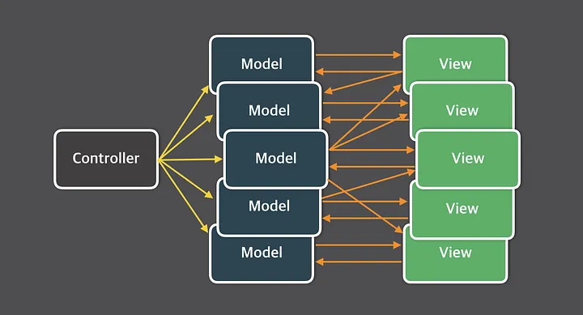

# 리액트와 상태 관리 라이브러리

---

> ***상태 관리가 왜 필요한지, 이 상태 관리가 어떻게 리액트와 함께 작동하는지를 간과하지 말자***
> 

## 상태 관리가 필요한 이유

---

<aside>
 **상태 관리 패러다임의 변화**

---

1. Flux 패턴의 등장 → 양방향 데이터 바인딩에서 단방향 데이터 바인딩으로
2. Redux의 등장 → Flux + Elm을 통해 전역 상태 관리로
3. Context API의 등장 → 작은 규모의 상태를 주입하기 위한 React API
4. Hook과 데이터 페칭 라이브러리의 등장 → 함수형의 시대와 더 작은 상태로
5. Recoil, Zustand, Jotai, Valtio의 등장 → 작은 상태들을 훅을 통해 효율적으로
</aside>

### 리액트 상태 관리의 역사

**Flux 패턴의 등장**

- Flux는 Context, Redux가 나오기 전에 리액트와 비슷한 시기에 등장한 라이브러리
- **웹이 비대해지며 상태 데이터가 많아짐에 따라 이를 추적하기가 어려워지던 상황**
- 양방향 데이터 바인딩이 문제라 판단 → 단방향 데이터 바인딩으로 Flux 패턴을 제안
    - 뷰(HTML)가 모델(자바스크립트)을 변경할 수 있으며 반대도 가능한 경우가 복잡
- Flux 패턴은 데이터 추적이 편리해지지만, 코드의 양이 많아지고 수고로워진다.
- **상태와 그 상태의 변경에 대한 흐름과 방식을 단방향으로 채택했다는 것이 주요 개념이다.**

<aside>
 **Flux 패턴에서 데이터가 흐르는 과정**

---



기존 MVC 패턴은 모델과 뷰가 많아질수록 복잡도가 증가한다.


Flux의 기본적인 단방향 데이터 흐름


Action이 발생하면 Dispatcher에서 이를 받아와 해석한 후 Store에 저장된 정보에 변경을 가하고, 그 결과가 View로 다시 전달되도록 한다.

**용어 정의**

- **`Action`** : 어떠한 작업을 처리할 액션과 그 액션 발생 시 함께 포함시킬 데이터를 의미한다. 액션 타입과 데이터를 각각 정의해 이를 디스패처로 보낸다. 마우스 클릭 이벤트가 발생했을 때 그 이벤트가 발생했음을 Action 정보를 담고 있는 객체를 만든다.
- **`Dispatcher`** : 액션을 받아서 액션이 정의한 타입과 데이터를 콜백 함수의 형태로 스토어st에게 보내는 역할을 한다.
- **`Store`** : 여기서 실제 상태에 따른 값과 상태를 변경할 수 있는 메서드를 가지고 있다. 액션의 타입에 따라 어떻게 이를 변경할지가 정의되어 있다.
- **`View`** : 리액트의 컴포넌트에 해당하는 부분으로, 스토어에서 만들어진 데이터를 가져와 화면을 렌더링하는 역할을 한다. 뷰에서도 사용자 입력이나 행위에 따라 상태를 업데이트하고자 할 때는 뷰에서 액션을 호출하는 구조로 구성한다.
</aside>

**시장 지배자 리덕스의 등장**

- 최초에는 Flux 구조를 구현하기 위해 만들어진 라이브러리 중 하나로, Elm 아키텍처가 도입됨
    - Elm은 웹페이지를 선언적으로 작성하기 위한 언어
    - Elm의 model, update, view는 각각 애플리케이션 상태, 모델을 표현하는 HTML, 모델을 수정하는 방식을 의미
- 하나의 상태 객체를 스토어에 저장해 두고, 이 객체를 업데이트하는 작업을 디스패치해 업데이트를 수행하는데, reducer 함수로 이를 발생시킴
- 글로벌 상태 객체를 통해 상태를 하위 컴포넌트에 전파할 수 있기 때문에 props drilling 문제를 해결했고 스토어가 필요한 컴포넌트에 connect로 접근만 하면 되었음
- 단순히 하나의 상태를 바꾸고 싶어도 해야 할 일이 너무 많고(액션의 타입 선언, 액션 수행용 creator와 함수 만들기, dispatcher/selector 만들기 등), 보일러 플레이트가 너무 많았음
    - 현재 버전의 리덕스는 많은 부분이 개선됨
    - 리액트와 리덕스는 표준처럼 굳어짐

**Context API와 useContext**

- 단순히 상태를 참조하고 싶을 분인데 리덕스의 보일러 플레이트가 부담스러웠던 상황
- props로 상태를 넘겨주지 않더라도 Context API를 사용하여 원하는 곳에 Context Provider가 주입하는 상태를 사용할 수 있게 됨
- 하지만 상태 관리가 아닌 상태 주입을 도와주는 기능으로 렌더링을 막아주지도 않으므로 사용 시의 주의가 필요함

**훅의 탄생, 그리고 React Query와 SWR**

**배경**

- 16.3에 Context API가 나와 1년도 되지 않아 16.8에 함수형 컴포넌트의 훅 API가 추가되었음
- 기존 무상태 컴포넌트를 선언하기 위해서만 제한적으로 사용됐던 함수형 컴포넌트가 대세가 되면서 state를 매우 손쉽게 재사용 가능하도록 만들 수 있게 됨

**React Query와 SWR**

- 외부에서 데이터를 불러오는 fetch를 관리하는 데 특화되었으나, API 호출에 대한 상태를 관리하고 있기에 HTTP 요청에 특화된 상태 관리 라이브러리라 할 수 있음
- 이런 데이터 페칭 라이브러리를 활용하면 애플리케이션 많은 부분에서 상태를 관리하는 코드가 사라짐

**Recoil, Zustand, Jotai, Valtio에 이르기까지**

- 모두 범용적으로 사용할 수 있는 상태 관리 라이브러리들
- 훅을 활용해 상태를 가져오거나 관리할 수 있는 다양한 라이브러리들이 등장
    
    ```jsx
    // Recoil
    const counter = atom({ key: 'count', default: 0 });
    const todoList = useRecoilValue(counter);
    
    // Jotai
    const countAtom = atom(0);
    const [count, setCount] = useAtom(countAtom);
    
    // Zustand
    const useCounterStore = create((set) => ({
    	count: 0,
    	increase: () => set((state) => ({ count: state.count + 1 })),
    }));
    const count = useCounterStore((state) => state.count);
    
    // Valtio
    const state = proxy({ count: 0 });
    const snap = useSnapshot(state);
    state.count++
    ```
    
- 기존 리덕스와의 큰 차이점으로 훅을 활용하여 작은 크기의 상태를 효율적으로 관리함
(대부분 peerDependencies로 리액트 16.8 버전 이상을 요구)
- 기존의 전역 상태 관리 패러다임에서 벗어나 개발자가 원하는 만큼의 상태를 지역적으로 관리하는 것을 가능하게 만들고, 훅을 지원함으로써 함수형 컴포넌트에서 손쉽게 사용할 수 있게됨

## 리액트 훅으로 시작하는 상태 관리

---

비교적 오랜 기간 리액트와 리덕스는 한 묶음으로 취급되어 하나의 프레임워크 또는 업계 포준(de facto)로 여겨졌으나, 현재는 Context API / useReducer / useState의 등장으로 컴포넌트에 걸쳐 재사용하거나 혹은 컴포넌트 내부에 걸쳐 상태를 관리할 수 있는 방법들이 점차 등장했다.

### useState와 useReducer

**함수형 컴포넌트에서 훅을 사용한 지역 상태 관리**

- useState의 등장으로 리액트에서 여러 컴포넌트에 걸쳐 손쉽게 동일한 인터페이스의 상태를 생성하게 관리할 수 있게 되었음
- 리액트 훅 기반으로 만들어진 상태 관리는 함수형 컴포넌트 어디서든 쉽게 재사용 가능함
- 훅을 사용할 때마다 컴포넌트별로 초기화되므로 컴포넌트에 따라 서로 다른 상태를 가질 수 밖에 없음 → 컴포넌트별로 상태의 파편화가 발생
- **훅을 사용한 해당 컴포넌트 내에서만 유효한 지역 상태 관리라는 점이 명확한 한계점**
    - 이를 해결하기 위해서는 훅을 부모 컴포넌트로 끌어올리고, 훅의 반환 값을 하위 컴포넌트의 props로 제공하여 하위 컴포넌트에서 참조하여 재사용하게끔 하는 방법이 있음
    - props 형태로 필요한 컴포넌트에 제공해야 한다는 점이 불편함
    - 컴포넌트 트리를 재설계해야 하는 등의 수고로움이 발생

### 지역 상태의 한계 벗어나기: useState의 상태를 바깥으로 분리하기

만약 useState가 리액트 클로저가 아닌 다른 자바스크립트 실행 컨텍스트 어디에선가 초기화되어 관리되면 어떨까? 이 상태를 참조하는 유효한 스코프 내부에서는 해당 객체의 값을 공유해서 사용할 수 있지 않을까?

```tsx
// counter.ts
export type State = { counter: number };

// 상태를 아예 컴포넌트 밖에 선언 -> 각 컴포넌트가 이 상태를 바라보도록 하자
let state: State = {
	counter: 0,
}

// getter
export function get(): State {
	return state
}

// useState와 동일하게 구현하기 위해 게으른 초기화 함수나 값을 받을 수 있도록 하자
type Initializer<T> = T extends any ? T | ((prev: T) => T) : never

// setter
export function set<T>(nextState: Initializer<T>) {
	state = typeof nextState === 'function' ? nextState(state) : nextState
}

// Counter
function Counter() {
	const state = get()
	
	function handleClick() {
		set((prev: State) => ({ counter: prev.counter + 1 })
	}
	
	return (
		<>
			<h3>{state.counter}</h3>
			<button onClick={handleClick}>+</button>
		</>
	)
}
```

**하지만 아쉽게도 이 방식은 리액트 환경에서 동작하지 않는다.**

- 디버깅을 해보면 set과 get으로 컴포넌트 외부의 state도 잘 업데이트 되고, 변수 최신값을 가져오는 것도 정상적으로 동작은 함
- 가장 큰 문제는 **‘컴포넌트가 리렌더링되지 않는다는 것’**
- 리액트에서 새 상태를 UI에 반영하기 위해서는 리렌더링이 반드시 필요함
- 함수형 컴포넌트의 재실행(호출), useState의 두 번째 인수 호출 등 다양한 방식으로 일어날 수 있으나 위 코드에는 리렌더링을 일으키는 장치가 없음
- 리렌더링을 위해서는 아래와 같은 작업 중 하나가 일어나야 함
    - useState, useReducer의 반환값 중 두 번째 인수가 어떠한 방식으로든 호출됨
    - 부모 함수가 리렌더링되거나 해당 함수가 다시 실행되어야 함
- 하지만 위 코드에는 부모 컴포넌트가 없고, props도 없어서 일일이 Counter를 재실행시켜야 하는데 이것이 매우 비효율적임

useState와 useReducer를 통해 해결해보자 → useState의 인수로 컴포넌트 밖에서 선언한 state를 넘겨주는 방식으로 코드를 변경해보자

```tsx
function Counter1() {
	const [count, setCount] = useState(**state**)
	
	function handleClick() {
		// 외부에서 선언한 set 함수 내부에서 다음 상태값을 연산한 다음,
		// 그 값을 로컬 상태값에도 넣어주자
		set((prev: State) => {
			const newState = { counter: prev.counter + 1}
			// setCount가 호출되면서 컴포넌트 리렌더링
			setCount(newState)
			return newState
		})
	}
	
	return (
		<>
			<h3>{state.counter}</h3>
			<button onClick={handleClick}>+</button>
		</>	
	)
}

// Counter1과 동일한 새 인스턴스
function Counter2() {
	const [count, setCount] = useState(**state**)
	
	function handleClick() {
		set((prev: State) => {
			const newState = { counter: prev.counter + 1}
			setCount(newState)
			return newState
		})
	}
	
	return (
		<>
			<h3>{state.counter}</h3>
			<button onClick={handleClick}>+</button>
		</>	
	)
}
```

- useState의 인수로 외부 상태인 state를 넘겨주는 것이 포인트
- handleClick에 set을 사용하도록 하여 useState의 리렌더링 효과 + 외부 상태의 업데이트 효과를 동시에 하도록 하는 것이 포인트

**하지만 이 방법은 매우 비효율적이며 문제점이 존재한다.**

- 외부에 상태가 있음에도 불구하고 리렌더링을 위해 함수 내부에 동일한 상태를 관리하는 useState가 존재하여 중복으로 상태를 관리함
- 실제 각 컴포넌트의 버튼을 누르면 이상하게 작동함
    - 한 쪽의 버튼을 누르면 한 쪽은 리렌더링되지만 반대쪽 컴포넌트는 렌더링되지 않음
    - useState가 컴포넌트 자체 내에서만 유효한 전략이기 때문

위 실험을 통해 아래와 같은 조건에 대한 결론을 얻을 수 있었다.

<aside>
 **함수 외부에서 상태를 참조하고 이를 통해 렌더링까지 일어나기 위한 조건**

---

1. 꼭 window나 global에 있어야 할 필요는 없지만 컴포넌트 외부 어딘가에 상태를 두고 여러 컴포넌트가 같이 쓸 수 있어야 한다.
2. 이 외부에 있는 상태를 사용하는 컴포넌트는 상태의 변화를 알아챌 수 있어야 하고 상태가 변화될 때마다 리렌더링이 일어나서 컴포넌트를 최신 상태값 기준으로 렌더링해야 한다. 이 상태 감지는 상태를 변경시키는 컴포넌트뿐만 아니라 이 상태를 참조하는 모든 컴포넌트에서 동일하게 작동해야 한다.
3. 상태가 원시값이 아닌 객체인 경우에 그 객체에 내가 감지하지 않는 값이 변한다 하더라도 리렌더링이 발생해서는 안 된다. 예를 들어, **{a: 1, b: 2}**라는 상태가 있으며 어느 컴포넌트에서 **a**를 **2**로 업데이트했다고 가정해 보자. 이러한 객체 값의 변화가 단순히 b의 값을 참조하는 컴포넌트에서는 일으켜서는 안 된다는 뜻이다.
</aside>

**위와 같은 기능을 만들어보기 위한 내용은 생략했으나 정리하면 아래와 같음**

1. 상태를 범용적 이름인 store로 정의하고 store를 만드는 createStore 함수 만들기
2. store 값이 변경될 때마다 변경되었음을 알리는 callback 함수를 실행하고, 이 callback을 등록할 수 있는 subscribe 함수를 만들기
3. store의 변화를 감지하고 컴포넌트 내에서 사용할 수 있도록 하는 useStore 훅 만들기
4. useStoreSelector는 useStore에 selector라는 인수를 추가하여 store 상태에서 어떤 값을 가져올 지를 설정할 수 있도록 하여 useStore의 한계를 해결

리액트 17 버전에서 위의 useStore와 같은 기능을 하는 `useSubscription` 라이브러리가 등장했고, 리액트 18버전에서는 이 라이브러리가 리액트 공식 API인 `useSyncExternalStore` 훅으로 다시 작성되었다. 이 훅은 외부에 있는 데이터를 가져와서 사용하고 리렌더링까지 정상적으로 수행시킬 수 있다.

## useState와 Context를 동시에 사용해 보기

---

앞선 useStore와 useStoreSelector 훅에는 한 가지 단점이 있는데, 이 훅과 스토어를 사용하는 구조는 반드시 하나의 스토어만 가지게 된다는 점이다. 하나의 스토어를 가지면 이 스토어는 마치 전역 변수처럼 작동하게 되어 동일한 형태의 여러 개의 스토어를 가질 수 없게 된다.

스토어가 필요할 때마다 반복적으로 스토어를 만들지 않고 여러 개의 서로 다른 데이터를 공유해 사용하고 싶다면 어떻게 해야 할까? store를 만드는 createStore를 여러 번 사용하면 되지 않을까?

```tsx
const store1 = createStore({count: 0});
const store2 = createStore({count: 1});
```

이 방법은 필요할 때마다 반복적으로 스토어를 만들어야 하니 번거롭다. 또한, 훅이 스토어에 의존적인 1:1 관계를 맺고 있으므로 매번 useStore와 같은 훅을 동일한 개수로 생성해야 한다.

이 문제를 해결하기 위해 리액트의 Context를 사용해보자. 스토어를 하위 컴포넌트에 주입한다면 컴포넌트에서 자신이 주입된 스토어에 대해서만 접근할 수 있게 된다.

```tsx
export const CountStoreContext = createContext<Store<CountStore>>(
    createStore<CountStore> ({
        count: 0 ,
        text: 'hello'
    })
)

export const CountStoreProvider = ({
    initalState,
    children
}: PropsWithChildren<{initalState: CountStore}>) => {
    const storeRef = useRef<Store<CountStore>>()

    //스토어 생성한 적이 없다면 최초에 한 번 생성한다.
    if(!storeRef.current) {
        storeRef.current = createStore(initalState)
    }

    return (
        <CountStoreContext.Provider value = {storeRef.current}>
            {children}
        </CountStoreContext.Provider>
    )
}
```

```tsx
export const useCounterContextSelector = <State extends unknown>(
	selector: (state: CounterStore) => State,
) => {
	const store = useContext(CounterStoreContext)
	// useStoreSelector를 사용해도 동일
	const subscriptbion = useSubscription(
		useMemo(
			() => ({
				getCurrentValue: () => selector(store.get()),
				subscribe: store.subscribe,
			}),
			[store, selector],
		),
	)
	

	return [subscription, store.set] as const
}
```

- 리액트에서 제공하는 useSubscription을 사용
- 스토어를 사용하는 컴포넌트는 해당 상태가 어느 스토어에서 온 상태인지 신경 쓰지 않아도 됨
- Context와 Provider를 관리하는 부모 컴포넌트 입장에서 자신이 자식 컴포넌트에 따라 보여주고 싶은 데이터를 Context로 잘 격리하기만 하면 됨

지역 상태가 아닌, 조금 더 넓은 스코프에서 사용할 수 있는 상태 관리를 만들어 보았다. 현재 다양한 상태 관리 라이브러리들이 있지만 이것들이 작동하는 방식은 결국 아래와 같이 요약된다.

<aside>
 **상태 관리 라이브러리들의 작동 방식 요약**

---

- useState, useReducer가 가지고 있는 한계인 컴포넌트 내부에서만 사용할 수 있는 지역 상태라는 점을 극복하기 위해 외부 어딘가에 상태를 둔다. 이는 컴포넌트의 최상단 내지는 상태가 필요한 부모가 될 수도 있고, 혹은 격리된 자바스크립트 스코프 어딘가일 수도 있다.
- 이 외부의 상태 변경을 각자의 방식으로 감지해 컴포넌트의 렌더링을 일으킨다.
</aside>

## 상태 관리 라이브러리 Recoil, Jotai, Zustand 살펴보기

---

리덕스와 MobX는 다양한 유스케이스와 관련 문서가 있으니 여기서 다루지 않고, 비교적 최근에 나왔으며 앞선 두 라이브러리의 대안으로 각광받고 있는 Recoil, Jotai, Zustand에 대해 살펴보자.

- Recoil과 Jotai는 Context/Provider, 훅을 기반으로 가능한 작은 상태를 효율적으로 관리하는 데 초점을 맞춤
- Zustand는 리덕스와 비슷하게 하나의 큰 스토어를 기반으로 상태를 관리함
    - 이 하나의 큰 스토어는 Context가 아니라 스토어가 가지는 클로저를 기반으로 생성
    - 스토어의 상태가 변경되면 이 상태를 구독하고 있는 컴포넌트에 전파하여 리렌더링

### Recoil 작동 방식 알아보기


- 페이스북에서 만든 리액트를 위한 상태 관리 라이브러리
- 훅의 개념으로 상태 관리를 시작한 최초의 라이브러리 중 하나
- 최소 상태 개념인 Atom이라는 개념을 선보임
- 정식 출시가 아닌 실험적으로 개발되고 운영되는 라이브러리 (여전히 실험 단계)
    - 리액트 18에서 제공되는 동시성 렌더링, 서버 컴포넌트, Streaming SSR 등이 지원되기 전까지 1.0.0을 배포하지 않을 것이라고 밝힘
    - 안정성이나 성능, 사용성 등을 보장할 수 없으며 호환성이 깨지는 변경 사항이 발생할 수도 있기 때문에 대규모 서비스에 사용하기에는 위험 부담이 따름
    - 그럼에도 간혹 실제 프로젝트에서 Recoil을 사용하여 안정적으로 서비스 중이라는 이야기도 들려오기에 개발자의 선택에 달림

**RecoilRoot**

Recoil(이하 리코일)을 사용하기 위해서는 애플리케이션 최상단에 RecoilRoot를 선언해야 한다.

```tsx
export default function App() {
	return <RecoilRoot>{/* 애플리케이션 최상위 컴포넌트 */}</RecoilRoot>
}
```

리코일 루트는 리코일에서 생성되는 상태값을 저장하기 위한 스토어를 생성하는 역할을 한다. 리코일 루트는 useStoreRef()를 사용하는데, **ancestorStoreRef**의 존재를 확인한다. 이는 Recoil에서 생성되는 **atom과 같은 상태값을 저장하는 스토어**를 의미한다. 이 useStoreRef가 가리키는 것은 AppContext가 가지고 있는 스토어다.

- **RecoilRoot 코드 훑어보기**
    
    https://github.com/facebookexperimental/Recoil/blob/main/packages/recoil/core/Recoil_RecoilRoot.js
    
    ```tsx
    function RecoilRoot(props: Props): React.Node {
    	const { override, ...propsExceptOverride } = props
    	
    	cosnt ancestorStoreRef = useStoreRef()
    	if (override === false && ancestorStoreRef.current !== defaultStore) {
    		// It means that this RecoilRoot is not nested within another.
    		return props.children
    	}
    	
    	return <RecoilRoot_INTERNAL {...propsExceptOvrride}/>
    }
    ```
    
    ```tsx
    // useStoreRef 코드
    const AppContext = React.createContext<StoreRef>({ current: defaultStore })
    const useStoreRef = (): StoreRef => useContext(AppContext)
    ```
    
    ```tsx
    // defaultStore
    function notInAContext() {
    	throw err('이 컴포넌트는 <RecoilRoot> 컴포넌트 내부에 있어야 합니다.')
    }
    
    const defaultStore: Store = Object.freeze({
    	storeID: getNextStoreID(),
    	getState: notInAContext,
    	replaceState: notInAContext,
    	getGraph: notInAContext,
    	subscribeToTransactions: notInAContext,
    	addTransactionMetadata: notInAContext,
    })
    ```
    
    - 디폴트 스토어에는 스토어 아이디 값을 가져오는 함수 getNextStoreID, 스토어의 값을 가져오는 함수 getState, 값을 수정하는 함수 replaceState 등이 있음
    - 해당 스토어 아이디를 제외하고는 모두 에러로 처리되어 RecoilRoot 외부에서는 스토어에 접근할 수 없다
    
    ```tsx
    const replaceState = (replacer: TreeState => TreeState) => {
      startNextTreeIfNeeded(storeRef.current);
      // Use replacer to get the next state:
      const nextTree = nullthrows(storeStateRef.current.nextTree);
      let replaced;
      try {
        stateReplacerIsBeingExecuted = true;
        replaced = replacer(nextTree);
      } finally {
        stateReplacerIsBeingExecuted = false;
      }
      if (replaced === nextTree) {
        return;
      }
      
    //... 생략
    
      // Save changes to nextTree and schedule a React update:
      storeStateRef.current.nextTree = replaced;
      if (reactMode().early) {
        **notifyComponents**(storeRef.current, storeStateRef.current, replaced);
      }
      nullthrows(notifyBatcherOfChange.current)();
    };
    ```
    
    - replaceState 함수는 상태가 변할 때 이 변경된 상태를 하위 컴포넌트로 전파해 컴포넌트에 리렌더링을 일으키는 **notifyComponents**가 있음
    
    ```tsx
    function notifyComponents(
      store: Store,
      storeState: StoreState,
      treeState: TreeState,
    ): void {
      const dependentNodes = getDownstreamNodes(
        store,
        treeState,
        treeState.dirtyAtoms,
      );
      for (const key of dependentNodes) {
        const comps = storeState.nodeToComponentSubscriptions.get(key);
        if (comps) {
          for (const [_subID, [_debugName, callback]] of comps) {
            callback(treeState);
          }
        }
      }
    }
    ```
    
    - store, 상태를 전파할 sotreState를 인수로 받아 이 스토어를 사용하는 하위 의존성을 모두 검색한 다음, 여기에 있는 컴포넌트들을 모두 확인해 콜백을 실행함
    - 값이 변경되었을 때, 콜백을 실행하여 상태 변화를 알리는 것은 이전에 실험한 내용과 같음
    
    <aside>
     **재귀적으로 종속된 노드를 모두 찾는 `getDownstreamNodes` 함수**
    
    ---
    
    ```tsx
    // Find all of the recursively dependent nodes
    function getDownstreamNodes(
      store: Store,
      state: TreeState,
      keys: $ReadOnlySet<NodeKey> | $ReadOnlyArray<NodeKey>,
    ): $ReadOnlySet<NodeKey> {
      const visitedNodes = new Set<NodeKey>();
      const visitingNodes = Array.from(keys);
      const graph = store.getGraph(state.version);
    
      for (let key = visitingNodes.pop(); key; key = visitingNodes.pop()) {
        visitedNodes.add(key);
        const subscribedNodes = graph.nodeToNodeSubscriptions.get(key) ?? emptySet;
        for (const downstreamNode of subscribedNodes) {
          if (!visitedNodes.has(downstreamNode)) {
            visitingNodes.push(downstreamNode);
          }
        }
      }
      return visitedNodes;
    }
    ```
    
    - 스토어, 트리의 현재 상태, 종속되어 있는 시작 노드의 키를 인자로 받음
    - 방문한 노드와 방문 중인 노드를 저장하기 위한 빈 집합과 배열을 생성
        - visitedNodes: 이미 방문한 노드 저장
        - visitingNodes: 방문하지 않은 노드를 저장, 초기값으로 keys 배열의 요소들을 복사
    - graph 변수에 store.getGraph(state.version)을 통해 현재 상태에 대한 그래프 정보를 가져옴 (노드 간의 종속성을 나타냄)
    - 이제 for 루프에서 visitingNodes 배열에서 노드를 하나씩 꺼내어 해당 노드에 종속된 노드를 찾음
        - pop() 메서드로 배열의 끝에서부터 하나씩 꺼내오며, null이 될 때까지 반복
        - 노드를 방문할 때마다 visitedNodes 집합에 추가
        - 종속 노드들은 subscribedNodes 집합에 추가, 없으면 emptySet을 기본값으로 설정
        - subscribedNodes에 있는 각 노드에 대해 방문하지 않은 노드의 경우 visitingNodes에 추가하여 나중에 방문하도록 함
        - 모든 노드를 방문한 뒤 visitedNodes를 반환 (시작 노드와 그에 종속된 모든 노드)
    
    **너비 우선 탐색(BFS) 알고리즘을 사용하여 그래프를 탐색**하고 있음을 알 수 있다.
    
    </aside>
    

**RecoilRoot의 구조 요약**

- Recoil 상태값은 RecoilRoot로 생성된 Context의 스토어에 저장됨
- 스토어의 상태값에 접근할 수 잇는 함수들이 있으며, 이 함수를 활용해 상태값에 접근하거나 상태값을 변경할 수 있음
- 값의 변경이 발생하면 이를 참조하고 있는 하위 컴포넌트에 모두 알림

**atom**

아톰은 리코일의 핵심 개념으로, 상태를 나타내는 리코일의 최소 상태 단위이다.

```tsx
type Statement = {
	name: string
	amount: number
}

const initialStatements: Array<Statement> = [
	{ name: '과자', amount: -500 },
	{ name: '용돈', amount: 10000 },
	{ name: '네이버페이충전', amount: -5000 },
]

// Atom 선언
const **statementsAtom** = atom<Array<Statement>>({
	key: 'statements',
	default: InitialStatements,
})
```

- atom은 key 값을 필수로 가지며, 다른 atom과 구별하는 식별자가 되므로 앱 내 유일값이어야 함
- default는 atom의 초깃값을 의미함

**useRecoilValue와 useRecoilState**

**useRecoilValue는 atom의 값을 반환하는 훅**이다. 상태를 읽을 수만 있게 하고 싶을 때 사용하는 것이 권장된다. 즉, 상태를 가져오기만 할 때 사용한다. 반면 **useRecoilState는 단순히 atom의 값을 가져오는 것 뿐만 아니라, 이 값을 변경할 수도 있는 훅**이다. 두 훅은 atom을 **구독**한다.

```tsx
function Statements() {
	const pay_statements = useRecoilValue(**statementsAtom**)
	const setPay_statements = useRecoilState(**statementsAtom**)
	return (
		<>{/* something.. */}</>
		//...
	)
}
```

- useRecoilValue 코드 내부에는 현재 리코일이 갖고 있는 상태값을 가져와서 이전 값과 비교하여 렌더링이 필요한지 확인하고, 렌더링을 일으키지 않으면서 값을 저장할 수 있는 ref에 매번 저장함
- useEffect를 통해 recoilValue가 변경되었을 때 forceUpdate를 호출해 렌더링을 강제로 일으키는데, 단순히 렌더링만 발생시키기 위해 실행된다.
- useRecoilState는 useState와 매우 유사한 구조로 작성되어 있으며, queueOrPerformStateUpdate 함수를 호출하여 상태를 업데이트하거나 업데이트가 필요한 내용을 등록함

**Recoil 구조 요약**

- 애플리케이션 최상단에 **<RecoilRoot />**를 선언해 하나의 스토어를 만듦
- **atom**이라는 상태 단위를 **<RecoilRoot />**에서 만든 스토어에 등록
- **atom**은 리코일에서 관리하는 작은 상태 단위이며, **key**라는 고유값을 바탕으로 구별
- 컴포넌트는 리코일에서 제공하는 훅을 통해 **atom**의 상태 변화를 **구독(subscribe)**하고, 값이 변경되면 **forceUpdate**같은 기법을 통해 리렌더링을 실행하여 최신 **atom** 값을 가져옴

**Recoil 사용 예제**

```tsx
const counterState = atom({
	key: 'counterState',
	default: 0,
})

function Counter() {
	const [, setCount] = useRecoilState(counterState)
	
	function handleButtonClick() {
		setCount((count) => count + 1)
	}
	
	return (
		<>
			<button onClick={handleButtonClick}>+</button>
		</>
	)
}
```

```tsx
// atom을 기반으로 또 다른 상태를 만들어보자
const isBiggerThan10 = **selector**({
	key: 'above10State',
	get: ({ get }) => {
		return get(counterState) >= 10
	},
})

function Count() {
	const count = useRecoilValue(counterState)
	const biggerThan10 = useRecoilValue(isBiggerThan10)
	
	return (
		<>
			<h3>{count}</h3>
			<p>count is bigger than 10: {JSON.stringify(biggerThan10)}</p>
		</>
	)
}
```

```tsx
export default function App() {
	return (
		<RecoilRoot>
			<Counter />
			<Count />
		</RecoilRoot>
	)
}
```

- **selector**는 한 개 이상의 atom, selector 값을 바탕으로 새로운 값을 조립할 수 있음
    - 리코일에서는 최소한의 상태들만 atom에 저장하고, 다른 모든 파생되는 데이터를 selector로 관리하는 것을 권장
- 이 외에도 atom에 비동기 작업도 추가할 수 있으며, useRecoilStateLoadable, waitForAll, waitForAny, waitForAllSettled와 같이 강력한 비동기 작업을 지원하기 위한 API도 지원

리코일은 리액트를 개발한 메타(페이스북)에서 개발하였으므로 앞으로도 리액트에서 새롭게 만들어지는 기능을 잘 지원할 것으로 보이지만, 아직 정식 버전이 출시되지 않았다는 것에서 부담이 될 수 있다. 리덕스와 달리 redux-saga, redux-thunk 등의 추가적인 미들웨어를 사용하지 않더라도 selector를 필두로 다양한 비동기 작업을 지원하여 수월하게 비동기 작업을 처리할 수 있다.

### Recoil에서 영감을 받은, 그러나 조금 더 유연한 Jotai


현재는 버전 2가 출시되었으나, 책이 작성된 1.8.3을 기준으로 기술되었다.

- 조타이는 상향식(bottom-up) 접근법을 취하고 있음
    - 리덕스와 같이 하나의 큰 상태를 애플리케이션에 내려주는 것이 아니라 작은 단위의 상태를 위로 전파할 수 있는 구조를 취하고 있음을 의미
- Context의 문제점인 불필요한 리렌더링 문제를 해결하고자 설계됨
    - 개발자들이 메모이제이션이나 최적화를 거치지 않아도 리렌더링이 발생하지 않도록 설계

**atom**

- 리코일에 영감을 받았듯 atom 개념이 존재하며 마찬가지로 최소 단위의 상태를 의미
- 차이점으로는 atom 하나로도 파생된 상태까지 만들 수 있다는 점에서 차이가 있음

```tsx
const counterAtom = atom(0)
```

- **조타이의 atom은 key를 넘겨주지 않아도 되어서 코드의 길이가 줄어듬**
    - atom 코드 내부의 key 변수에는 외부에서 받지 않고 toString()을 위한 용도로 한정
    - 그리고 config를 반환
        - 초깃값의 의미하는 init, 값을 가져오는 read, 값을 설정하는 write만 존재
- **조타이의 atom은 실제로 상태를 저장하고 있지 않음 → 어떠한 정의에 가까움**
    - **그럼 어디에 저장해두는 걸까? → useAtomValue를 알아보자**

**useAtomValue**

리코일의 useRecoilValue와 같이 상태값을 read만 할 때 사용하는 훅이다.

```tsx
export function useAtomValue<Value>(
  atom: Atom<Value>,
  scope?: Scope
): Awaited<Value> {
  const ScopeContext = getScopeContext(scope)
  const scopeContainer = useContext(ScopeContext)
  const { s: store, v: versionFromProvider } = scopeContainer

  const getAtomValue = (version?: VersionObject) => {
    const atomState = store[READ_ATOM](atom, version)
    //...
  }

// Pull the atoms's state from the store into React state.
const [[version, valueFromReducer, atomFromReducer], rerenderIfChanged] =
  useReducer<
    Reducer<
      readonly [VersionObject | undefined, Awaited<Value>, Atom<Value>],
      VersionObject | undefined
    >,
    VersionObject | undefined
  >(
    (prev, nextVersion) => {
      const nextValue = getAtomValue(nextVersion)
      if (Object.is(prev[1], nextValue) && prev[2] === atom) {
        return prev // bail out
      }
      return [nextVersion, nextValue, atom]
    },
    versionFromProvider,
    (initialVersion) => {
      const initialValue = getAtomValue(initialVersion)
      return [initialVersion, initialValue, atom]
    }
  )

  let value = valueFromReducer
  if (atomFromReducer !== atom) {
    rerenderIfChanged(version)
    value = getAtomValue(version)
  }

  useEffect(() => {
    const { v: versionFromProvider } = scopeContainer
    if (versionFromProvider) {
      store[COMMIT_ATOM](atom, versionFromProvider)
    }
    
    const unsubscribe = store[SUBSCRIBE_ATOM](
      atom,
      rerenderIfChanged,
      versionFromProvider
    )
    rerenderIfChanged(versionFromProvider)
    return unsubscribe
  }, [store, atom, scopeContainer])

	//...
	
  useDebugValue(value)
  return value
}
```

- **useAtomValue**의 내부 코드
- 눈여겨 볼 것은 **useReducer**로, 3가지 상태를 반환
    - **`[version, valueFromReducer, atomFromReducer]`**
    - 순서대로 store의 버전, atom에서 get을 수행햇을 때 반환되는 값, atom 그 자체
- 리코일과 다르게 컴포넌트 루트 레벨에서 **Context**가 존재하지 않아도 됨
    - **Provider**가 없는 형태로 스토어를 루트에 생성하고 이를 활용해 값을 저장함
        - **Jotai**에서 **Provider**를 제공하기도 해서 이를 통해 각 **Provider** 별로 사용도 가능
    - **atom**의 값은 **store**에 존재하며 **store**에 **atom** 객체 그 자체로 키를 활용하여 저장됨
    - **자바스크립트의 WeakMap을 활용하여 별도의 key를 사용하지 않아도 저장할 수 있음**
- **rerenderIfChanged**는 넘겨받은 **atom**이 **Reducer**를 통해 스토어에 있는 **atom**과 값이 다를 경우, **subscribe**를 수행하고 있다 어디선가 이 값이 달라지는 경우 일어남

**useAtom**

**useState**와 동일한 형태의 배열을 반환하는 훅이다. **useAtomValue**의 결과를 반환하는 첫 번째 원소와 **useSetAtom** 훅이라는 두 번째 원소를 반환한다. setState와 비슷한 개념이다.

```tsx
export function useSetAtom<Value, update, Result extends void | Promise<void>>(
	atom: WritableAtom<Value, Update, Result>,
	scope?: Scope,
): SetAtom<Update, Result> {
	const ScopeContext = getScopeContext(scope)
	const { s: store, w: versionedWrite } = useContext(ScopeContext)
	const setAtom = useCallback(
		(update: Update) => {
			//...
			**const wrtie = (version?: VersionObject) =>
				store[WRITE_ATOM](atom, update, version)**
			return versionedWrite ? versionedWrite(write) : write()
		},
		[store, versionedWrite, atom],
	)
	return setAtom as SetAtom<Update, Result>
}
```

- **useAtom**의 내부 코드
- **setAtom**이라는 콜백 함수 내부에서 사용하고 있는 write 함수는 스토어에서 해당 atom을 찾아 직접 값을 업데이트함
- 이후 스토어에서 새로운 값을 작성한 후에는 해당 값의 변화에 대해 알고 있어야 하는 listener 함수를 실행해 값의 변화가 있음을 전파 후 사용하는 쪽에서 리렌더링

**Jotai 사용 예제**

```tsx
import { atom, useAtom, useAtomValue } from 'jotai'

const counterState = atom(0)

function Counter() {
	const [, setCount] = useAtom(counterState)
	
	function handleButtonClick() {
		setCount((count) => count + 1)
	}
	
	return (
		<>
			<button onClick={handleButtonClick}>+</button>
		</>
	)
}
```

```tsx
const isBiggerThan10 = atom((get) => get(counterState) > 10)

function Count() {
	const count = useAtomValue(counterState)
	const biggerThan10 = useAtomValue(isBiggerThan10)
	
	return (
		<>
			<h3>{count}</h3>
			<p>count is bigger than 10: {JSON.stringify(biggerThan10)}</p>
		</>
	)
}
```

```tsx
export default function App() {
	return (
		<>
			<Counter />
			<Count />
		</>
	)
}
```

- Jotai의 atom API에는 리액트의 useState와 다르게 컴포넌트 외부에서도 선언할 수 있음
- atom은 값뿐만 아니라 함수를 인수로 받을 수 있음
    - atom의 값으로부터 파생된 atom을 만들 수 있음
    - 컴포넌트 내부에서 useAtom을 활용해 useState와 비슷하게 사용하거나 useAtomValue를 통해 getter만 가져올 수도 있음
- 이외에도 localStorage 연동이나 Next.js, 리액트 네이티브와 연동하는 등의 상태 관련 작업을 지원

**Jotai 특징 요약**

- Recoil에서 영향을 받고, Recoil의 한계를 극복하기 위한 노력
    - API가 간결하여 보일러 플레이트가 줄어듦 → WeakMap으로 객체에 key가 필요 없어짐
    - 파생된 상태를 위해 새로운 API 필요 없이 그대로 atom을 사용하여 간결
- 100% 타입스크립트로 작성되었음
- 리액트 18 버전까지 무리없이 지원하며 빠른 업데이트
    - Recoil의 대체재로 많은 개발자들이 선택하여 개발중

### 작고 빠르며 확장에도 유연한 Zustand


Zustand는 주스탠드라 읽으며 독일어로 상태라는 뜻을 가진다.

- zustand는 리덕스에 영감을 받아 만들어진 상태 관리 라이브러리
- atom이 아니라 하나의 스토어를 중앙 집중형으로 활용해 이 스토어 내부에서 상태를 관리

하나의 큰 스토어가 어떻게 만들어지는지 살펴보고, 각 상태 값을 어떻게 참조하는지, 리렌더링을 어떻게 유도하는지 알아보자. (4.1.1 버전을 기준으로 작성)

**Zustand의 바닐라 자바스크립트 코드**

```tsx
const createStoreImpl: CreateStoreImpl = (createState) => {
  type TState = ReturnType<typeof createState>
  type Listener = (state: TState, prevState: TState) => void
  **let state: TState**
  const listeners: Set<Listener> = new Set()

  **const setState: SetStateInternal<TState> = (partial, replace) => {**
  //...
    const nextState =
      typeof **partial** === 'function'
        ? (partial as (state: TState) => TState)(state)
        : partial
    if (nextState !== state) {
      const previousState = state
      state =
        **replace** ?? typeof nextState !== 'object'
          ? (nextState as TState)
          : Object.assign({}, state, nextState)
      listeners.forEach((listener) => listener(state, previousState))
    }
  }

  const getState: () => TState = () => state

  const subscribe: (listener: Listener) => () => void = (listener) => {
    listeners.add(listener)
    // Unsubscribe
    return () => listeners.delete(listener)
  }

  const destroy: () => void = () => listeners.clear()
  const api = { setState, getState, subscribe, destroy }
  state = (createState as PopArgument<typeof createState>)(
    setState,
    getState,
    api
  )
  return api as any
}
```

- createStoreImpl의 내부 코드
- 이전에 만들어본 바닐라 스토어와 유사하게 **state**의 값을 useState 외부에서 관리
- setState에는 특이하게 partial과 replace로 나뉨
    - partial은 state의 일부분만 변경하고 싶을 때 사용
    - replace는 state를 완전히 새로운 값으로 변경하고 싶을 때 사용
    - state의 값이 객체일 때 필요에 따라 나눠서 사용할 수 있음
- getState는 클로저의 최신 값을 가져오기 위한 함수
    - subscribe는 추가 삭제 및 중복 관리가 용이한 Set 형태로 선언된 listener를 등록
        - 상태 값이 변경될 때 리렌더링이 필요한 컴포넌트에 전파될 목적으로 만들어짐
- destory는 listeners를 초기화하는 역할
- createStore는 이렇게 만들어진 getState, setState, subscribe, destory를 반환

zustand의 메인 코드인 스토어 코드에는 어떠한 것도 import 하지 않으며 리액트를 비롯한 그 어떤 프레임워크와 별개로 완전히 독립적으로 구성돼 있다. 때문에 순수 자바스크립트 환경에서도 사용할 수 있다.

```tsx
type CounterStore = {
	count: number
	increase: (num: number) => void
}

const store = createStore<CounterStore>((set) => ({
	count: 0,
	increase: (num: number) => set((state) => ({ count: state.count + num })),
}))

store.subscribe((state, prev) => {
	if (state.count != prev.count) {
		console.log('count has been changed', state.count)
	}
})

store.setState((state) => ({ count: state.count + 1 }))

store.getState().increase(10)
```

- 바닐라 자바스크립트에서 사용하는 zustand
- createStore를 할 때, set이라는 인수를 활용하여 생성할 수 있다는 점
    - state를 생성할 때 setState, getState, api를 인수로 넘겨줬기 때문에 가능함
    - set을 통해 현재 스토어의 값을 재정의할 수도 있고, 두 번째 인수로 get을 추가해 현재 스토어의 값을 받아올 수도 있음
- getState와 setState를 통해 현재 스토어의 값을 받아오거나 재정의할 수 있음

**Zustand의 리액트 코드**

```tsx
export function useStore<TState, StateSlice>(
	api: WithReact<StoreApi<TState>>,
	selector: (state: TState) => StateSlice = api.getState as any,
	equalityFn?: (a: StateSlice, b: StateSlice) => boolean,
) {
	const slice = useSyncExternalStoreWithSelector(
		api.subscribe,
		api.getState,
		api.getServerState || api.getState,
		selector,
		equalityFn,
	)
	useDebugValue(slice)
	return slice
}
```

- 리액트 18 버전부터 등장한 **useSyncExternalStoreWithSelector**를 이용하여 **useStore**의 **subscribe**, **getState**를 넘겨주고, 선택을 원하는 **state**를 고르는 함수인 **selector**를 넘겨줌
- **useSyncExternalStoreWithSelector**는 useSyncExternalStore와 동일하지만 원하는 값을 가져올 수 있는 selector와 동등 비교를 할 수 있는 equalityFn 함수를 받는 차이가 있음
- 객체가 예상되는 외부 상태값에서 일부 값을 꺼내올 수 있게 **useSyncExternalStoreWithSelector**를 사용한 모습

**리액트에서 사용할 수 있는 스토어를 만들어주는 변수 create**

```tsx
const createImpl = <T>(createState: StateCreator<T, [], []>) => {
//...
  const api =
    typeof createState === 'function' ? createStore(createState) : createState

  const useBoundStore: any = (selector?: any, equalityFn?: any) =>
    useStore(api, selector, equalityFn)

  Object.assign(useBoundStore, api)

  return useBoundStore
}

export const create = (<T>(createState: StateCreator<T, [], []> | undefined) =>
  createState ? createImpl(createState) : createImpl) as Create
```

- 리액트 create는 바닐라의 createStore를 기반으로 거의 유사하게 작성됨
- 차이점으로 useStore를 사용하여 해당 스토어가 즉시 리액트 컴포넌트에서 사용할 수 있도록 만들어졌다는 점
- useBoundStore에 api를 Object.assign을 통해 복사했는데, 이는 useBoundStore에 api의 모든 함수를 복사하여 api도 동일하게 사용할 수 있게 제공함

**리액트 환경에서 스토어 생성하고 사용하기**

```tsx
import { create } from 'zustand'

const **useCounterStore** = create((set) => ({
	count: 1,
	inc: () => set((state) => ({ count: state.count + 1 })),
	dec: () => set((state) => ({ count: state.count - 1 })),
})

function Counter() {
	**const { count, inc, dec } = useCounterStore()**
	return (
		<div class="counter">
			<span>{count}</span>
			<button onClick={inc}>+</button>
			<button onClick={dec}>-</button>
		</div>
	)
}
```

- 컴포넌트 내부에 스토어를 생성하고 사용하는 방법
- **store**의 반환 값으로 이 스토어를 컴포넌트 내부에서 사용할 수 있는 **훅**을 반환받음
    - 이 훅을 사용하여 스토어 내부에 있는 **getter**와 **setter** 모두에 접근해 사용할 수 있음

```tsx
**const counterStore = createStore((set) => ({**
	//... 위와 동일
}))

function Counter() {
	**const { count, inc, dec } = useStore(counterStore)**
	return(
		//... 위와 동일
	)
}
```

- 외부에서 스토어를 생성하고 useStore 훅을 통해 리액트 컴포넌트 내부에서 사용하는 방법

**zustand 정리**

- 리덕스 대비 확실히 구별되는 특징으로, 특별히 많은 코드를 작성하지 않아도 빠르게 스토어를 만들고 사용할 수 있음
- zustand 자체 라이브러리 크기는 고작 2.9kB
- 미들웨어를 지원하여 create의 두 번째 인수로 추가할 수 있음
    - persist, immer, 리덕스 미들웨어 등 사용 가능
- zustand store는 스토어가 가지는 클로저를 기반으로 생성됨
    - 스토어 상태가 변경될 때 이 상태를 구독하고 있는 컴포넌트에 전파하여 리렌더링을 알림
- setState는 partial과 replace로 나뉘어 상태 값이 객체일 때를 대비
- 프레임워크와 독립적으로 구성되어 바닐라 자바스크립트에서도 사용 가능