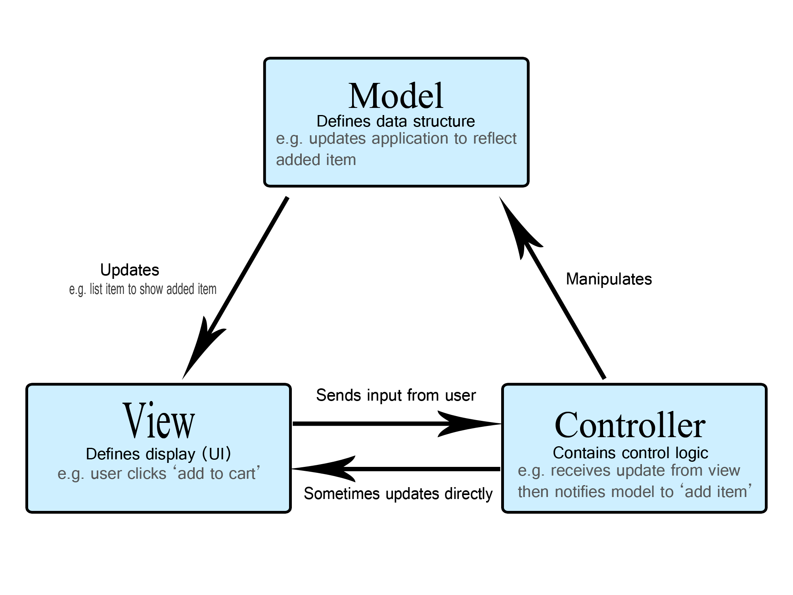
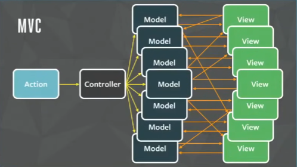
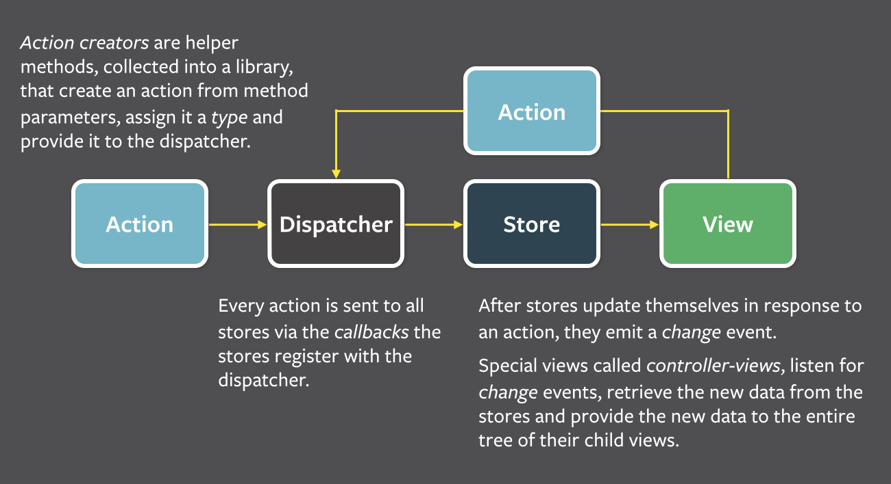
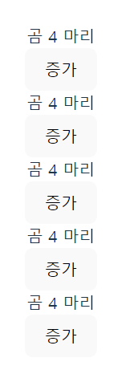

## 상태 관리의 역사

### MVC



- MVC 패턴은 소프트웨어의 디자인 패턴 중 하나로, 데이터(Model), UI(View), 비즈니스 로직(Controller) 으로 구분하여 관심사의 분리를 이뤄낸 디자인 패턴입니다.
- Flux 패턴이 고안되기 전에는 MVC 패턴을 주로 사용했습니다.



- 그러나 Facebook 팀은 기존의 MVC 패턴으로 개발 하다 보면, Model과 View 사이의 데이터 흐름이 양방향으로 연결되는 구조로 개발할 가능성이 높아지고, 이는 데이터의 추적을 어렵게 한다고 생각했습니다.
- 그래서 고안해낸 것이 Flux 패턴입니다.

### Flux



- Flux 아키텍처는 데이터 변화의 흐름을 무조건 단방향으로 강제하여, 어플리케이션이 복잡해지더라도 데이터가 변화하는 원인을 쉽게 추적할 수 있도록 합니다.
- 모든 상태의 변화는 반드시 중재자 Dispatcher를 통해서만 변화가 가능합니다.
  - **Action**: 처리해야 할 행동(action type)과, 변화시킬 데이터(payload)의 조합을 의미합니다.
  - **Dispatcher**: 액션이 들어왔음을 스토어에게 알리는 역할을 합니다.
  - **Store**: 실제 데이터와, 데이터를 변화시키는 메소드가 들어있는 곳입니다.
  - **View**
    - 스토어에 보관된 데이터를 가지고 실제로 UI를 표현하는 것으로, 리액트 컴포넌트가 여기에 포함됩니다.
    - 데이터를 변화시켜야 하는 경우, View가 직접 Store를 변경하는 것이 아니라, Dispatcher에게 Store를 변경 시키고 싶다는 Action을 전달해야 합니다.

### Redux

- Redux는 Flux와 Elm에서 영감을 받아 만들어진 상태 관리 도구입니다.
- Redux에는 아래 3가지 요소가 포함됩니다.
  - **Store**
    - 전역 상태를 포함하는 단일 스토어.
    - 전체 스토어에서 유사한 로직만 응집하여 Slice로 분리한 뒤, combineReducer 로 합치는 방식으로 단일 스토어를 구성합니다.
  - **Dispatcher**
    - 앱에 어떤 상태 변화(Action)가 발생할 때, Store에게 Action을 전달하여 데이터를 변화시키도록 하는 요소.
  - **Reducer**
    - 순수 함수로, 이전 State와 변경하려는 Action을 받아서 새로운 다음 State를 반환하는 순수 함수.
    - Reducer는 반드시 순수 함수여야 하기에, 비동기 작업을 처리해야 하는 경우에는 미들웨어를 사용해야 합니다. ex) redux-thunk, redux-saga

### Context API

- 상위 컴포넌트의 데이터를 하위 컴포넌트 트리에 전달해주는, 일종의 의존성 주입 도구입니다.
- 기존에는 상위 컴포넌트 트리에 존재하는 데이터를 하위 컴포넌트로 전달하기 위해서는 props drilling이 유일한 방법이었습니다. (혹은 React 외부에서 상태를 관리하거나)
- 그래서 16.3 버전에 도입되었고, 16.8 버전에서 hook이 도입되면서 `useContext` 훅도 추가되었습니다. 이제 19 버전부터 useContext 훅은 `use` 훅으로 대체될 예정입니다.

### React-Query, SWR

- 프론트엔드에서 API 호출을 통해 외부에서 데이터를 가져오는 경우는 굉장히 빈번합니다.
- 이 경우 로딩, 에러 등의 상태는 물론이며 실질적인 정보의 원천은 서버에 존재하기 때문에, 주기적으로 동기화하는 등의 작업도 중요합니다.
- 이러한 문제점을 해결하기 위해 Stale-While-Revalidate 캐시 정책의 아이디어를 활용해 등장한 것이 react-query와 swr 라이브러리입니다.

### Recoil, Zustand, Jotai, Valtio

- React-Query, SWR같은 라이브러리가 외부 서버로부터 받아오는 비동기 상태를 모두 처리해주다보니, Redux와 같이 거대하고 견고한 상태관리 라이브러리의 필요성이 비교적 줄어들었습니다.
- 그래서 간소화된 상태관리 라이브러리가 많이 등장했습니다.

## React 외부의 상태를 React와 동기화하기

- useStore

  ```jsx
  import { useEffect, useState } from 'react';

  type Store<State> = {
    getState: () => State;
    setState: (nextState: State) => void;
    subscribe: (listener: VoidFunction) => VoidFunction;
  };

  type Initializer<T> = T extends unknown ? T | ((prev: T) => T) : never;

  /**
   * 스토어를 생성합니다.
   */
  export const createStore = <State>(
    initialState: Initializer<State>
  ): Store<State> => {
    let state =
      typeof initialState === 'function' ? initialState() : initialState;

    const listeners = new Set<VoidFunction>();

    const subscribe = (listener: VoidFunction) => {
      listeners.add(listener);
      return () => {
        listeners.delete(listener);
      };
    };

    const getState = () => state;

    const setState = (nextState: State) => {
      state = nextState;
      listeners.forEach((listener) => listener());
    };

    return { getState, setState, subscribe };
  };

  /**
   * 리액트 컴포넌트에서 스토어를 사용할 수 있게 해주는 훅입니다.
   */
  export const useStore = <State>(store: Store<State>) => {
    const [state, setState] = useState(() => store.getState());

    useEffect(() => {
      const unsubscribe = store.subscribe(() => {
        setState(store.getState());
      });

      return unsubscribe;
    }, [store]);

    return [state, store.setState] as const;
  };

  ```

- 사용

  ```jsx
  import { createStore, useStore } from '../core/store';

  const bearStore = createStore(1);

  const BearComponent = () => {
    const [bear, setBear] = useStore(bearStore);

    return (
      <div>
        <div>곰 {bear} 마리</div>
        <button onClick={() => setBear(bear + 1)}>증가</button>
      </div>
    );
  };

  export default BearComponent;

  function App() {
    const [count, setCount] = useState(0);

    return (
      <>
        <BearComponent />
        <BearComponent />
        <BearComponent />
        <BearComponent />
        <BearComponent />
      </>
    );
  }
  ```

- 결과
  

### 상태관리 라이브러리

- **recoil**
  - 페이스북에서 만든 리액트를 위한 상태 관리 라이브러리입니다. (인터페이스가 useState의 사용법과 유사)
  - atom 기반의 상향식 접근 방법을 사용합니다.
  - 현재까지도 정식 버전이 미출시이며, 현재 유지보수가 잘 안되는 상황입니다.
  - `atom` 으로 최소 단위의 상태를 만듭니다.
  - `useRecoilValue` 훅으로 아톰의 값을 가져올 수 있습니다.
  - `useRecoilState` 훅으로 아톰의 값과 디스패치 함수를 가져올 수 있습니다. (useState와 유사한 인터페이스)
  - `useRecoilSelector` 훅으로 파생 상태를 사용합니다.
- j**otai**
  - recoil에 영감을 받아 만들어진 라이브러리입니다.
  - `atom` 으로 최소 단위의 상태를 만듭니다.
  - recoil과는 다르게, atom을 생성할 때 key를 필요로 하지 않습니다. 이는 객체 자체를 내부적으로 키를 사용하여 WeakMap 객체로 관리하기 때문입니다.
  - `useAtom` 훅으로 아톰의 값과 디스패치 함수를 가져올 수 있습니다.
- **zustand**
  - redux에 영감을 받아 만들어진 라이브러리입니다.
  - 리액트 외부 영역에 클로저로 스토어를 관리하고, useSyncExternalWithSelector shim으로 리액트와 연동합니다.
  - 변화를 감지하려하는 프로퍼티를 개발자가 직접 selector 함수에 작성해줘야 하는 수동 렌더링 최적화 방식을 사용합니다.

### References

https://developer.mozilla.org/ko/docs/Glossary/MVC

[https://velog.io/@teo/프론트엔드에서-MV-아키텍쳐란-무엇인가요](https://velog.io/@teo/%ED%94%84%EB%A1%A0%ED%8A%B8%EC%97%94%EB%93%9C%EC%97%90%EC%84%9C-MV-%EC%95%84%ED%82%A4%ED%85%8D%EC%B3%90%EB%9E%80-%EB%AC%B4%EC%97%87%EC%9D%B8%EA%B0%80%EC%9A%94)

https://medium.com/@benlaud/qml-application-architecture-guide-with-flux-b4e970374635

https://haruair.github.io/flux/docs/overview.html

https://www.youtube.com/watch?v=nYkdrAPrdcw&list=PLb0IAmt7-GS188xDYE-u1ShQmFFGbrk0v

https://developer.mozilla.org/ko/docs/Glossary/MVC

https://ko.redux.js.org/introduction/why-rtk-is-redux-today

https://ko.redux.js.org/understanding/history-and-design/prior-art/

원티드 프리온보딩 5월
