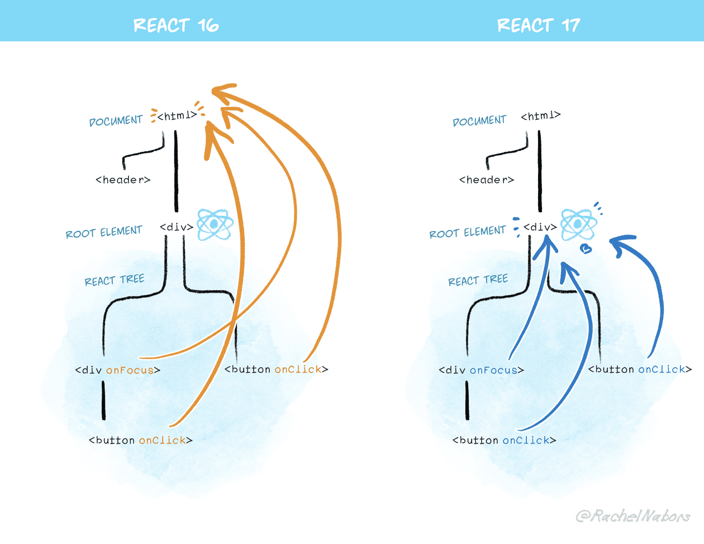

## 리액트 17 버전 변경점

### 점진적 업그레이드

- 이전에는 리액트의 버전을 올리기 위해서는 반드시 전체 프로젝트에 적용되어 있는 리액트의 버전을 한꺼번에 변경하는 방법밖에 없었습니다.
- 그런데 이제 17 버전부터는 일부 영역에만 16 버전을 적용하고, 다른 영역에는 17 버전을 적용하는 등 점진적인 업그레이드가 가능해졌습니다.
- 다만, 이는 어디까지나 한꺼번에 업그레이드가 불가능한 상황을 위한 기능이고, 일반적으로는 관리 지점이 늘어나게 되는 문제가 있기 때문에 가능하다면 전체 버전을 업그레이드 하는 것이 좋습니다.

### 변경된 JSX transform

- 이전에는 리액트 컴포넌트 파일 내에서 `React` 를 사용하지 않더라도 반드시 import 구문이 필요했었습니다.
- 이는 기존에 JSX 구문을 JS로 트랜스파일링하는 과정에서 JSX 구문이 `React.createElement` 를 호출하는 코드로 변경되기 때문이었는데, 이젠 `react/jsx-runtime` 을 활용하는 형태로 변경되었고 `import` 구문도 자동으로 주입해주기 때문에 더 이상 개발자가 직접 `import` 하지 않아도 되게 되었습니다.
- 참고로, 리액트 19 버전부터는 `React.createElement` 로 변환되는 방식이 완전히 deprecated 될 예정입니다.

### 이벤트 위임 방식 변경



- 이전에는 리액트 컴포넌트에 등록된 이벤트 핸들러가 DOM 최상위 요소에 위임되었습니다.
- 그런데, 리액트 17 버전부터는 루트 요소에 위임하는 방식으로 변경되었습니다.

<aside>
💡 **왜 이렇게 바뀌었나요?**
1. 점진적인 업그레이드가 적용되어서 한 프로젝트 안에서 리액트 버전이 여러 개가 될 수 있고, 이는 즉 루트 노드가 여럿이 될 수 있다는 이야기입니다. 그러나 DOM 최상위 요소는 단 하나만 존재하기 때문에, **여러 개의 리액트 버전에서 하나의 DOM 요소에 이벤트를 위임하여 등록하는 것은 잠재적인 버그를 유발할 가능성**이 있기 때문입니다.

2. 만약 document.addEventListener(...) 를 사용해서 수동 DOM 리스너를 추가했다고 할 때, 16 이전 버전에서는 **리액트 컴포넌트의 핸들러에서 e.stopPropagation() 을 호출하더라도 무조건 수동 DOM 리스너가 동작**했습니다. 그러나 17 버전부터는 이런 일은 발생하지 않습니다. 즉, React 에서의 이벤트 전파가 일반 DOM과 더욱 유사한 예측 가능한 형태로 변경되었습니다.

</aside>

### 이벤트 풀링 제거

- 리액트 16 이전 버전에서는 이벤트를 핸들링하는 데 합성 이벤트(SyntheticEvent)라는 래퍼를 구성해서 사용하고 있었습니다.
- 이는, 이벤트 객체를 미리 풀에 등록해 놓고 실제 이벤트 핸들러에서 이벤트가 발생할 때마다 풀에서 꺼내와서 사용한 뒤에 다시 null로 초기화하여 풀에 넣어 놓는 방식으로 동작하는 것 이었는데 사실상 최신 브라우저에서는 이러한 풀링으로 얻을 수 있는 성능적인 이점은 없고, 개발자에게 혼란만 준다고 판단되어 17 버전에서는 제거되었습니다.
- 리액트 16 이전에서의 동작 방식
  - 이벤트 핸들러 내부에 비동기로 동작하는 로직이 있는 경우, 이벤트 객체는 이미 event pool로 들어가서 null로 초기화된 상황이기에 참조할 수 없는 문제가 발생했었습니다.
  ```jsx
  function handleChange(e) {
    setData((data) => ({
      ...data,
      // This crashes in React 16 and earlier:
      text: e.target.value,
    }));
  }
  ```
  - 그래서 이를 해결하려면 `e.persist()` 를 사용해야 했었는데, 직관적이지 않고 혼란스러운 동작이었습니다.
  ```jsx
  function handleChange(e) {
    e.persist();
    setData((data) => ({
      ...data,
      // This crashes in React 16 and earlier:
      text: e.target.value,
    }));
  }
  ```

### useEffect 클린업 함수의 비동기 실행

- 리액트 16 이전 버전에서는, `useEffect` 의 클린업 함수가 동기적으로 처리되었습니다. 즉, Render Phase에서 다음 스냅샷의 렌더링을 처리하기 이전에 `useEffect`의 클린업 함수를 먼저 처리해야 했습니다.
- 만약 클린업 함수의 처리 시간이 길어진다면, 다른 작업을 Blocking하는 현상이 발생할 수 있었는데 이를 해결하기 위해 `useEffect` 의 클린업 함수가 비동기적으로 처리되도록 바뀌었습니다. 즉, 리렌더링 과정에서 다음 스냅샷의 Commit 단계를 마친 이후에, 이전 스냅샷의 클린업 함수가 실행됩니다.
- 기존: Cleanup → Rerender → New Effect
- 현재: Rerender → Cleanup → New Effect

## 리액트 18 버전 변경점

### Auto Batching

- 리액트에서 동일한 타이밍에 호출한 상태 업데이트는 하나의 업데이트로 묶어서 배칭처리합니다.
- 그런데 17 이전 버전에서는 이벤트 핸들러에서는 배칭 처리가 되었지만, `setTimeout` 이나 `Promise` 와 같은 비동기 이벤트에 대해서는 배칭 처리가 되지 않고 있어서 일관성이 없었습니다.
- 이제 18 버전에서는 모두 일괄적으로 배칭 처리가 됩니다. (createRoot로 루트 노드를 생성한 경우)
- 만약, 배칭처리 하고싶지 않은 상태 업데이트가 있다면 `flushSync` 를 사용하면 됩니다.

### Suspense

- Suspense는 리액트 16.6 버전에서 도입된 기능으로, 컴포넌트를 동적으로 가져올 수 있어서 코드 스플리팅에 자주 사용되는 기능이었습니다.
- 이제는 Promise를 throw하는 방식으로 비동기 컴포넌트가 준비되는 동안 fallback UI를 보여주고 싶을 때에도 활용할 수 있도록 확장되었습니다.
- Suspense의 기능이 확장됨에 따라, 서버에서 준비가 완료된 컴포넌트부터 점진적으로 렌더링하는 Steaming SSR와, 전체 페이지를 한번에 하이드레이션하는 것이 아니라 부분적으로 하이드레이션을 먼저 수행하는 Selective Hydration 가 도입되었습니다.

### useId

```jsx
const id = useId();
```

- 고유한 ID를 만들 수 있는 훅입니다. (UUID와 비슷한 기능)
- SSR 환경에서 생성한 ID와, Client-Side에서 Hydration하는 과정에서 생성된 ID가 일치함을 보장합니다. (Hydration Mismatch 문제가 발생하지 않게 도와줌)
- 구현부

  ```
  function mountId(): string {
    const hook = mountWorkInProgressHook();

    const root = ((getWorkInProgressRoot(): any): FiberRoot);
    // TODO: In Fizz, id generation is specific to each server config. Maybe we
    // should do this in Fiber, too? Deferring this decision for now because
    // there's no other place to store the prefix except for an internal field on
    // the public createRoot object, which the fiber tree does not currently have
    // a reference to.
    const identifierPrefix = root.identifierPrefix;

    let id;
    if (getIsHydrating()) {
      const treeId = getTreeId();

      // Use a captial R prefix for server-generated ids.
      id = ':' + identifierPrefix + 'R' + treeId;

      // Unless this is the first id at this level, append a number at the end
      // that represents the position of this useId hook among all the useId
      // hooks for this fiber.
      const localId = localIdCounter++;
      if (localId > 0) {
        id += 'H' + localId.toString(32);
      }

      id += ':';
    } else {
      // Use a lowercase r prefix for client-generated ids.
      const globalClientId = globalClientIdCounter++;
      id = ':' + identifierPrefix + 'r' + globalClientId.toString(32) + ':';
    }

    hook.memoizedState = id;
    return id;
  }

  function updateId(): string {
    const hook = updateWorkInProgressHook();
    const id: string = hook.memoizedState;
    return id;
  }
  ```

### useTransition

```jsx
const [isPending, startTransition] = useTransition();
```

- startTransition의 콜백 내부에 작성하는 상태 업데이트의 우선 순위를 TransitionLane으로 보내버려서 더 빨리 렌더링해야 하는 작업을 먼저 처리할 수 있도록 해주는 훅입니다.
- 해당 작업보다 우선 순위가 더 높은 작업이 존재함으로 렌더링이 지연되고 있음을 `isPending` 상태 변수로 표현합니다.
- `useTransition` 훅 내부에서는 `startTransition` 를 사용하고 있습니다. 따라서 컴포넌트가 아닌 곳에 우선순위를 내리는 업데이트 작업을 직접 `startTransition` 를 import해도 됩니다.

```jsx
import { startTransition } from 'react';
```

- 구현부

  ```jsx
  function mountTransition(): [
    boolean,
    (callback: () => void, options?: StartTransitionOptions) => void
  ] {
    const [isPending, setPending] = mountState(false);
    // The `start` method never changes.
    const start = startTransition.bind(null, setPending);
    const hook = mountWorkInProgressHook();
    hook.memoizedState = start;
    return [isPending, start];
  }

  function updateTransition(): [
    boolean,
    (callback: () => void, options?: StartTransitionOptions) => void
  ] {
    const [isPending] = updateState(false);
    const hook = updateWorkInProgressHook();
    const start = hook.memoizedState;
    return [isPending, start];
  }
  ```

### useDefferedValue

```jsx
const deferredValue = useDeferredValue(value);
```

- `useTransition` 가 상태 업데이트 동작 자체의 우선 순위를 낮췄다면, `useDefferedValue` 는 값 자체가 변경되는 시점의 우선 순위를 낮춥니다.
- 디바운싱이나 쓰로틀링으로도 값의 연산을 최적화할 수 있긴 하지만, 이 경우에는 이미 Call Stack에 작업이 들어온 이후에는 더 높은 우선순위의 작업이 들어와도 중단할 수 없다는 문제점이 있고, 최소 단위 시간이 필요하다는 문제가 있습니다. (useDefferedValue는 단위 시간이 필요하지는 않고 작업이 가능한 순간이 되면 바로 처리)
- 구현부

  - `updateDeferredValueImpl` 를 살펴보면
    1. **업데이트를 지연해야 하는 경우**
       claimNextTransitionLane 를 사용해서 새로운 차선(Lane)만 할당 받아 놓은 다음에 이전 값(prevValue) 를 그대로 반환합니다.
    2. **지금 업데이트 해도 되는 경우**
       hook.memoizedState 값을 변경합니다.

  ```jsx
  function mountDeferredValue<T>(value: T): T {
    const hook = mountWorkInProgressHook();
    hook.memoizedState = value;
    return value;
  }

  function updateDeferredValue<T>(value: T): T {
    const hook = updateWorkInProgressHook();
    const resolvedCurrentHook: Hook = (currentHook: any);
    const prevValue: T = resolvedCurrentHook.memoizedState;
    return updateDeferredValueImpl(hook, prevValue, value);
  }

  function updateDeferredValueImpl<T>(hook: Hook, prevValue: T, value: T): T {
    const shouldDeferValue = !includesOnlyNonUrgentLanes(renderLanes);
    if (shouldDeferValue) {
      // This is an urgent update. If the value has changed, keep using the
      // previous value and spawn a deferred render to update it later.

      if (!is(value, prevValue)) {
        // Schedule a deferred render
        const deferredLane = claimNextTransitionLane();
        currentlyRenderingFiber.lanes = mergeLanes(
          currentlyRenderingFiber.lanes,
          deferredLane
        );
        markSkippedUpdateLanes(deferredLane);

        // Set this to true to indicate that the rendered value is inconsistent
        // from the latest value. The name "baseState" doesn't really match how we
        // use it because we're reusing a state hook field instead of creating a
        // new one.
        hook.baseState = true;
      }

      // Reuse the previous value
      return prevValue;
    } else {
      // This is not an urgent update, so we can use the latest value regardless
      // of what it is. No need to defer it.

      // However, if we're currently inside a spawned render, then we need to mark
      // this as an update to prevent the fiber from bailing out.
      //
      // `baseState` is true when the current value is different from the rendered
      // value. The name doesn't really match how we use it because we're reusing
      // a state hook field instead of creating a new one.
      if (hook.baseState) {
        // Flip this back to false.
        hook.baseState = false;
        markWorkInProgressReceivedUpdate();
      }

      hook.memoizedState = value;
      return value;
    }
  }
  ```

### useSyncExternalStore

```jsx
const snapshot = useSyncExternalStore(subscribe, getSnapshot, getServerSnapshot?)
```

- React 18에서 도입된 동시성 렌더링을 사용하는 경우, 외부 데이터를 구독했을 때 컴포넌트마다 화면에서 그려지는 값이 달라지는 Tearing 현상이 발생할 수 있습니다.
- 그래서 외부 스토어를 동기적으로 구현하도록 도와주는 훅입니다.

### useInsertionEffect

- CSS-in-JS 라이브러리 개발자들이 DOM 요소에 스타일을 주입할 수 있도록 제공하는 훅입니다.
- DOM이 실제로 변경되기 전에 동기적으로 실행됩니다.
- useInsertionEffect(DOM 반영 이전) → useLayoutEffect(DOM 반영 이후) → useEffect 순서로 실행됩니다.

## References

[https://puki4416blog.netlify.app/how-to-react-event-handle/#syntheticevent-객체](https://puki4416blog.netlify.app/how-to-react-event-handle/#syntheticevent-%EA%B0%9D%EC%B2%B4)

[https://medium.com/crossplatformkorea/react-리액트를-처음부터-배워보자-06-합성-이벤트와-event-pooling-6b4a0801c9b9](https://medium.com/crossplatformkorea/react-%EB%A6%AC%EC%95%A1%ED%8A%B8%EB%A5%BC-%EC%B2%98%EC%9D%8C%EB%B6%80%ED%84%B0-%EB%B0%B0%EC%9B%8C%EB%B3%B4%EC%9E%90-06-%ED%95%A9%EC%84%B1-%EC%9D%B4%EB%B2%A4%ED%8A%B8%EC%99%80-event-pooling-6b4a0801c9b9)

https://ko.legacy.reactjs.org/blog/2020/08/10/react-v17-rc.html#no-event-pooling

https://blog.mathpresso.com/suspense-ssr-architecture-in-react-18-ec75e80eb68d
