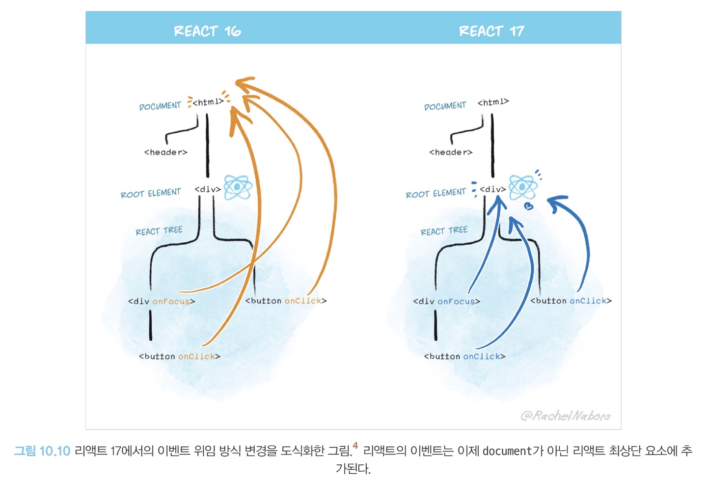

### 리액트 17 버전 살펴보기

#### 점진적인 업데이트가 17 버전부터 가능하게 되었다.

- 하지만 이건 언제까지나 차선책이지 한꺼번에 업데이트 하는 것이 복잡성 감소 측면에서 좋다.

#### 이벤트 위임 방식의 변경

- 이벤트 위임
  - 이벤트를 상위 컴포넌트에만 붙이는 것을 의미힌다.
  - 이벤트 타입(click, change)당 하나의 핸들러를 루트에 부착한다.
  - 17 이전에서는 이벤트 위임이 모두 document에서 이루어 졌는데, document가 아닌 리액트 컴포넌트 최상단 트리(루트)로 바뀌었다.
    - 이는 이벤트 버블링으로 인한 혼선을 막을 수 있다.
      

#### `import React from 'react'`가 더 이상 필요없다.

- 이러한 import 구문 없이도 JSX를 JS로 변환할 수 있게 되었다.
  - 이를 통해 번들링 크기도 약간 줄일 수 있고, 컴포넌트 작성을 더욱 간결하게 해준다.

#### 그 밖의 주요 변경 사항

- 이벤트 폴링이 제거 되었다.
  - 이벤트 폴링 : SyntheticEvent 풀을 만들어서 이벤트가 발생할 때마다 가져오는 것을 의미한다.
- useEffect 클린업 함수의 비동기 실행
  - 클린업 함수는 리액트 16 버전까지는 동기적으로 처리됐다. 이로 인해 클린업 함수가 완료되기 전까지는 다른 작업들의 실행이 멈추므로 불필요한 성능 저하로 이어졌다.
  - 17 부터는 화면이 완전히 업데이트된 이후(커밋 단계가 완료될 때까지)에 클린업 함수가 비동기적으로 실행된다. => 이로인해 시간적으로 빨라지는 성능적인 이점을 볼 수 있게 되었다.
- 컴포넌트의 undefined 반환에 대한 일관적인 처리
  - 17부터는 forwardRef나 memo에서 undefined를 반환하는 경우에도 에러를 발생시킨다.
  - 18 부터는 undefined를 반환해도 에러가 발생하지 않는다.
