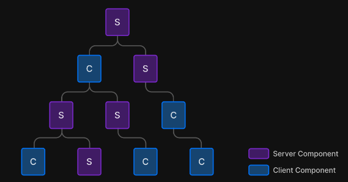

# Next.js 13과 리액트 18

---

**목차**

<aside>
 **Next 13의 5가지 큰 변화**

---

1. **New App Directory Structure**:
   Next.js 13에서는 `app` 디렉토리 구조가 도입되었습니다. 이 구조는 페이지 기반 라우팅을 더욱 명확하게 하고, 더 나은 파일 구조를 제공합니다.
2. **Server Components**:
   React 18과 함께 발표된 React Server Components를 Next.js 13은 정식으로 지원합니다. 서버에서 프리렌더링을 통해 클라이언트로 전송되기 때문에 앱 성능이 크게 향상됩니다.
3. **Optimal Image Optimization**:
   Next.js 13에서는 새로운 이미지 최적화 기능이 도입되었습니다. 이는 이미지 크기를 자동으로 조절하여 더 빠른 로딩 속도와 최적의 품질을 유지합니다.
4. **Streaming and SSR with Suspense**:
   스트리밍과 SSR 기능은 Suspense를 통해 더욱 강화됩니다. 이제 더 나은 사용자 경험을 제공하기 위해 데이터를 비동기적으로 로드할 수 있습니다.
5. **Turbopack (Alpha)**:
Next.js 13에서는 새로운 번들러인 Turbopack의 알파 버전이 소개되었습니다. Turbopack은 Webpack보다 최대 700배 더 빠른 퍼포먼스를 제공하며, 초기 번들링 속도와 확장성 측면에서 큰 이점을 제공합니다.
</aside>

## app 디렉터리의 등장

---

Next.js 12 버전까지 **공통 레이아웃을 유지할 수 있는 방법은 `_app`이 유일**

→ 각 페이지 별로 서로 다른 레이아웃을 유지할 수 있도록 app 레이아웃 등장

### **app 디렉터리의 라우팅**

**라우팅**

- 기존에는 파일 시스템 기반으로 동작 (`/pages/` 하위)
- Next.13부터 `/app/a/b`는 `/a/b`로 변환되고 파일명은 무시
  → app 디렉터리 내부의 파일명은 라우팅 명칭에 영향이 없음
- app 디렉터리 내부 폴더명이 라우팅됨
  - 이 폴더에 포함할 수 있는 layout.js가 있으면, 그 하위 폴더 및 주소에 모두 영향을 끼침

→ 파일명 라우팅에서 **폴더명 라우팅으로 변경**

```
app/
├── layout.tsx        # 기본 레이아웃을 정의
├── page.tsx          # 루트 경로(/)에 대한 페이지 정의
├── about/
│   └── page.tsx      # /about 경로에 대한 페이지 정의
├── product/
│   ├── [id]/
│   │   └── page.tsx  # /product/[id] 경로에 대한 동적 페이지 정의
│   └── layout.tsx    # /product 경로의 레이아웃 정의
├── error.tsx         # 오류 상태에 대한 화면 정의
└── loading.tsx       # 로딩 상태에 대한 화면 정의
```

**layout.js**

- 레이아웃 기능을 하는 예약어
- 루트 layout은 모든 페이지에 영향을 미치는 공통 레이아웃 (html, head 등을 다룸)
  → \_app과 \_document를 하나로 대체
  → 꼭 공통 레이아웃이 없더라도 웹페이지에 필요한 기본 정보만 담아도 유용
  → \_document가 사라지면서 CSS-in-JS는 루트의 레이아웃에서 적용하는 방식으로 바뀜
- 페이지 하위에 추가되는 layout은 해당 주소 하위에만 적용
  → 이로써 하나의 앱에서 레이아웃을 더욱 유연하게 구성할 수 있게 됨
- **주의할 점**
  - app 디렉터리 내부에서는 예약어로 동작하며, 레이아웃 이외에는 사용 불가
  - 외부에서 children을 주입하여 렌더링해야 함
  - 내부에는 export default로 내보내는 컴포넌트가 있어야 함
  - layout 내부에도 비동기 작업 수행이 가능

**page.js**

- 페이지 기능을 하는 예약어

**error.js**

- 해당 라우팅 영역에서 사용되는 공통 에러 컴포넌트
- 특정 라우팅별 서로 다른 에러 UI를 렌더링할 수 있음
- 에러 바운더리는 클라이언트에서만 작동한다는 점을 명심
  - error 컴포넌트도 클라이언트 컴포넌트여야 함
  - `<Layout><Error>{children}</Error></Layout>` 구조로 페이지가 렌더링되기 때문에
    error와 같은 수준의 layout에서 에러가 발생하면 해당 error 컴포넌트로 이동하지 않음

**not-found.js**

- 특정 라우팅 하위 주소를 찾을 수 없는 404 페이지 렌더링에 사용

**loading.js**

- 리액트 Suspense 기반으로 해당 컴포넌트가 불러오는 중임을 나타낼 때 사용

**route.js**

- pages 디렉터리 내부의 API 경로와 동일하므로 API 경로와 라우트 핸들러를 함께 사용할 필요가 없음 → route.ts가 있는 폴더 내부에는 page.ts가 존재할 수 없음
- 파일 내부에 REST API의 get, post와 같은 메서드명을 예약어로 선언하면 HTTP 요청에 맞게 해당 메서드를 호출하는 방식으로 작동 (app/api 외 다른 곳에서 선언해도 작동)
- request, context 파라미터를 받을 수 있음
  - request: NextRequest 객체로, fetch의 Request를 확장한 Next.js의 Request
  - context: params만을 가지고 있는 객체로, 동적 라우팅 파라미터 객체 포함

## 리액트 서버 컴포넌트

---

<aside>
 **서버 컴포넌트는 서버 사이드 렌더링과 완전히 다른 개념이다.**

</aside>

### 기존 리액트 컴포넌트와 서버 사이드 렌더링의 한계

**모든 문제는 리액트가 클라이언트 중심으로 돌아가기 때문에 발생한다.**

- 자바스크립트 번들 크기가 0인 컴포넌트를 만들 수 없음
  → 모든 로직, 외부 라이브러리, 상태 관리가 클라이언트로 전송되어 실행해야만함
- 백엔드 리소스에 대한 직접적인 접근이 불가능
  → 만약 클라이언트에서 직접 백엔드에 접근해 데이터를 가져올 수 있다면?
- 자동 코드 스플릿이 불가능
  → lazy 로딩을 일일이 하지 말고 서버에서 자동으로 코드 분할을 해준다면?
- 연쇄적으로 발생하는 클라이언트와 서버의 요청을 대응하기 어려움
  → 데이터를 불러오고 컴포넌트를 렌더링하는 것이 모두 서버에서 이루어진다면?
- 추상화에 드는 비용이 증가
  → 복잡한 추상화에 따른 결과물을 연산하는 작업을 서버에서 수행하면 어떨까?
  → 클라이언트에서는 복잡한 작업을 하지 않아도 되니 속도가 빨라지고, 결과물 또한 단순

### 서버 컴포넌트란?

**서버 컴포넌트**

- 서버와 클라이언트 모두에게 컴포넌트를 렌더링할 수 있는 기법을 의미
- 일부 컴포넌트는 서버에서, 일부 컴포넌트는 클라이언트에서 렌더링되는 것
- 클라이언트 컴포넌트는 서버 컴포넌트를 import 할 수 없음
  - 서버 환경이 브라우저에는 존재하지 않아 서버 컴포넌트를 실행할 수 없음




**어떻게 이런 구조가 가능할까? → `ReactNode`에 있다.**

- **서버 컴포넌트**
  - 요청이 오면 서버에서 딱 한 번 실행되므로 상태를 가질 수 없음
  - 한번 렌더링되면 끝이므로 렌더링 생명주기도 없음
  → useState, useEffect와 effect 및 state에 의존하는 사용자 정의 훅을 사용할 수 없음
  - DOM API, window, document에 접근할 수 없음
  - DB, 내부 서비스, 파일 시스템 등 서버에만 있는 데이터를 async/await으로 접근할 수 있음
  - 다른 서버 컴포넌트를 렌더링하거나 클라이언트 컴포넌트를 렌더링할 수 있음
- **클라이언트 컴포넌트**
  - 서버 컴포넌트를 불러오거나 서버 전용 훅 및 유틸리티를 불러올 수 없음
  - 서버 컴포넌트는 클라이언트 컴포넌트를 렌더링 할 수 있는데, 그 클라이언트 컴포넌트가 자식으로 서버 컴포넌트를 갖는 구조는 가능
  → 클라이언트 컴포넌트는 이미 서버에서 만든 트리에 삽입이 가능하기 때문
- **공용 컴포넌트 (shared component)**
  - 서버와 클라이언트 모두에서 사용할 수 있는 컴포넌트로, 두 컴포넌트의 제약을 모두 받음

**CC와 SC를 어떻게 판단할 수 있는가?**

- 리액트는 모든 것을 다 공용 컴포넌트로 판단하기에 모든 컴포넌트를 다 서버에서 실행 가능한 것으로 분류함
- 대신, 클라이언트 컴포넌트라는 것을 명시적으로 선언 (`”use client”`) → 클라이언트 제약 사항

→ 도구의 없이 개발하기가 매우 어려워졌고, 리액트 팀에서도 번들러 및 프레임워크 사용을 권장

### 서버 사이드 렌더링과 서버 컴포넌트의 차이

**서버 사이드 렌더링**

- 응답받은 페이지 전체를 HTML로 렌더링하는 과정을 서버에서 수행한 후 결과를 클라이언트에 내려주고, 하이드레이션을 통해 서버의 결과물을 확인하고 이벤트를 붙임
- 인터랙션이 불가능한 정적인 HTML을 빠르게 내려주는 것이 주 목적
- 초기 HTML 로딩 후 JS 리소스를 다운로드하고 파싱하고 실행하는 비용은 여전히 발생

**서버 컴포넌트**

- 특정 “컴포넌트”를 서버에서 렌더링하여 클라이언트로 전송하여 직접 서버 데이터를 다룰 수 있음
- 효율적인 데이터 페칭, 번들 크기와 효율성, 보안 등의 목적을 가짐

<aside>
 둘은 대체제가 아닌 **상호보완하는 개념**으로 보아야 한다. 리액트 팀에서는 미래에는 두 가지 기법이 모두 쓰일 수 있는 가능성을 암시하고 있다.

</aside>

### 서버 컴포넌트는 어떻게 작동하는가?

**리액트 팀에서 제공한 코드에서 서버 컴포넌트의 동작 방식**

1. 서버가 렌더링 요청을 받는다. (루트 컴포넌트는 항상 서버 컴포넌트)
2. 서버는 받은 요청에 따라 컴포넌트를 JSON으로 직렬화 (이 때 CC 부분은 플레이스홀더 형식으로 비워두고 나타냄)
3. 브라우저가 리액트 컴포넌트 트리를 구성 (JSON을 파싱한 것을 바탕으로 컴포넌트를 구성)

**서버 컴포넌트의 작동방식은 무엇이 특별한가?**

- 서버 → 클라이언트로 데이터를 보낼 때 스트리밍 형태로 보내서 클라이언트가 JSON을 줄 단위로 읽고 렌더링 하기 때문에 결과물을 더 빨리 보여줄 수 있음
- 컴포넌트들이 하나의 번들러 작업에 포함되지 않고 각 컴포넌트 별로 번들링이 별개로 되어 필요에 따라 컴포넌트를 지연해서 받거나 따로 받는 작업이 가능
- 결과물이 HTML이 아닌 JSON

## Next.js에서의 리액트 서버 컴포넌트

---

- 서버 컴포넌트를 온전히 사용하기 위해서는 프레임워크의 도움이 필수
- Next.js 13 버전부터 서버 컴포넌트 도입 → /app 디렉터리에 구현

Next.js 프로젝트에서 루트 컴포넌트는 각 페이지에 존재하는 page.js와 layout.js는 반드시 서버 컴포넌트여야 하며, 서버 컴포넌트의 제약을 받는다.

### 새로운 fetch 도입, getServerSideProps, getStaticProps, getInitialProps의 삭제

**삭제**

- getServerSideProps
- getStaticProps
- getInitialProps

**도입**

- 모든 데이터 요청이 fetch API로 이루어짐
- fetch API를 확장하여 서버에서 캐싱하는 기능 (SWR, React-Query처럼)

### 정적 렌더링과 동적 렌더링

- 정적인 라우팅에 대해서는 기본적으로 빌드 타임에 렌더링을 미리 해두고 캐싱하여 재사용
- 동적인 라우팅에 대해서는 서버에 매번 요청이 올 때마다 컴포넌트를 렌더링하도록 함

**정적 렌더링**

```tsx
// app/page.tsx
async function fetchData() {
  const res = await fetch(`https://jsonplaceholder.typicode.com/posts`);
  const data = await res.json();
  return data;
}

export default async function Page() {
  const data: Array<any> = await fetchData();

  return (
    <ul>
      {data.map((item, key) => (
        <li key={key}>{item.id}</li>
      ))}
    </ul>
  );
}
```

- 정적으로 결정되어 있기 때문에 빌드 시에 해당 주소로 미리 요청을 해서 데이터를 가져온 다음 렌더링한 결과를 빌드에 넣어둠

**동적 렌더링**

```tsx
// app/page.tsx
async function fetchData() {
  const res = await fetch(
    `
		https://jsonplaceholder.typicode.com/posts`,
    { cache: 'no-cache' } // no-cache 옵션 추가
    // === `{ next: { revalidate: 0}}` (next 제공 옵션도 동일)
  );
  const data = await res.json();
  return data;
}

export default async function Page() {
  const data: Array<any> = await fetchData();

  return (
    <ul>
      {data.map((item, key) => (
        <li key={key}>{item.id}</li>
      ))}
    </ul>
  );
}
```

- 캐싱하지 않겠다는 의도를 밝히면 Next.js는 해당 컴포넌트를 미리 빌드하지 않고 요청이 올 때마다 fetch 요청 이후에 렌더링을 수행
- next/headers 또는 next/cookie와 같은 헤더 정보 및 쿠키 정보를 불러오는 함수를 사용하면 해당 함수는 동적 연산을 바탕으로 결과를 반환하는 것으로 인식하여 정적 렌더링 대상에서 제외

**동적 주소지만 특정 주소만 캐싱하고 싶은 경우** (=getStaticPaths)

```tsx
export async function **generateStaticParams**() {
	return [{ id: '1' }, { id: '2' }, { id: '3' }, { id: '4' }]
}

async function fetchData() {
	const res = await fetch(`https://jsonplaceholder.typicode.com/posts`)
	const data = await res.json()
	return data
}

export default async function Page(
	params,
): {
	params: { id: string }
	children?: React.ReactNode
} {
	const data: Array<any> = await fetchData()

	return (
		<ul>
			{data.map((item, key) => (
				<li key={key}>{item.id}</li>
			))}
		</ul>
	)
}
```

- 이렇게 하면 기존 getStaticProps의 작동 방식을 그대로 흉내 냄
- Next.js에서 동적 경로를 지원하면서도 특정 경로만 정적으로 렌더링하고 캐싱하고 싶은 경우, `generateStaticParams` 함수를 사용하여 미리 렌더링할 경로를 지정할 수 있음

**fetch 옵션에 따른 작동 방식**

- `fetch(URL, { cache: ‘force-cache’ })`
  - 기본값
  - getStaticProps와 유사하게 **불러온 데이터를 캐싱해 해당 데이터로만 관리**
- `fetch(URL, { cache: ‘no-store’ })`, `fetch(URL, { next: {revalidate: 0} })`
  - getServerSideProps와 유사하게 캐싱하지 않고 **매번 새로운 데이터를 불러옴**
- `fetch(URL, { next: {revalidate: 10} })`
  - getStaticProps에 revalidate를 추가한 것과 동일
  - **정해진 유효시간 동안에는 캐싱**하고, 이 유효시간이 지나면 캐시를 파기함
- `fetch(URL, { cache: ‘no-cache’ })`
  - 캐시를 사용하지 않지만, 서버와의 검증 작업을 거침
  - **서버에게 요청을 보내고 서버는 데이터가 변경되었는지 확인한 후에 응답** 반환
  - 캐싱된 데이터가 있어도 항상 서버에게 요청을 보내고 검증함

### 캐시와 mutating, 그리고 revalidating

**fetch 내부에서 캐시와 갱신이 이뤄지는 과정**

1. 최초로 해당 라우트로 요청이 올 때는 미리 정적으로 캐시해 둔 데이터를 보여줌
2. 이 캐시된 초기 요청은 revalidate에 선언된 값만큼 유지
3. 만약 해당 시간이 지나도 일단은 캐시된 데이터를 보여줌
4. Next.js는 캐시된 데이터를 보여주는 한편, 시간이 경과했으므로 다시 데이터를 불러옴
5. 4번이 성공하면 캐시된 데이터를 갱신하고, 실패하면 과거 데이터를 보여줌

→ 캐시를 전체적으로 무효화하려면 `router.refresh()` 사용
(브라우저나 리액트의 state에는 영향이 가지 않음)

### 스트리밍을 활용한 점진적인 페이지 불러오기

- 기존 SSR과 다르게, HTML을 작게 쪼개 완성되는 대로 클라이언트로 점진적으로 보냄
- 사용자가 일부라도 페이지와 인터랙션을 할 수 있음
- 핵심 웹 지표인 TTFB(최초 바이트까지의 시간)과 최초 콘텐츠풀 페인팅(FCP) 개선에 큰 도움


기존 SSR


스트리밍을 활용한 SSR

- **Loading, Suspense를 활용**하면 Next.js에서 스트리밍을 활성화

## 웹팩의 대항마, 터보팩의 등장(beta)

---

- Rust, Go 등의 빠른 언어를 활용한 번들러들 (Rome, SWC, esbuild) 등장
- 웹팩의 후계자를 자처하는 터보팩(Turbopack)이 등장
  - vite 대비 최대 10배, 웹팩 대비 최대 700배 빠르다고 소개됨
  - 현재 개발 모드에서 제한적으로 사용 가능
  - 주목되는 프로젝트

## 서버 액션(alpha)

---

**API를 생성하지 않더라도 함수 수준에서 서버에 직접 접근해 데이터 요청 등을 수행할 수 있는 기능**

클라이언트 측에서 서버로 데이터를 보내고, 서버에서 다시 이를 처리해서 응답을 보내는 전통적인 방법보다 더 간결하고 효율적으로 데이터를 처리할 수 있게 됨

- SC와 다르게 **특정 함수 실행 그 자체만 서버에서 수행**할 수 있다는 장점
- 실행 결과에 따라 다양한 작업을 수행할 수 있음
- 아직 실험 기능으로 사용 (next.config.js에서 설정)

### 서버 액션의 주요 특징과 장점

1. **서버에서 직접 실행**: 서버 액션은 서버에서 직접 실행되므로, 데이터베이스 접근이나 비즈니스 로직 같은 민감한 작업을 안전하게 수행할 수 있습니다.
2. **단순한 API 호출**: 서버 액션은 API 라우트를 설정할 필요 없이 간단한 함수 호출로 사용할 수 있습니다.
3. **자동화된 데이터 처리**: Next.js의 자동화된 데이터 패칭 및 리렌더링을 통해 클라이언트 측에서 더 적은 코드로 효율적인 데이터 관리를 할 수 있습니다.
4. **보안성**: 클라이언트 측에서 서버로 데이터를 보내는 과정에서 발생할 수 있는 보안 취약점을 줄일 수 있습니다.

**`"use server"` 지시자를 추가하고, `async`로 선언한 함수**에만 사용 가능하다.

서버 액션을 남용하면 서버에 부하를 줄 수 있으므로, 필요한 경우에만 사용한다.

### 서버 액션의 서버 뮤테이션 함수

서버에서의 데이터 수정으로 실행할 수 있는 함수

- **`redirect`**
  특정 주소로 리다이렉트
  import { redicret } from ‘next/navigation’으로 사용
- **`revalidatePath`**
  해당 주소의 캐시를 즉시 업데이트
  ’import { revalidate } from ‘next/cache’로 사용
- **`revalidateTag`**
  추가한 캐시 태그를 구분하고, 특정 태그가 추가된 fetch 요청을 모두 초기화
  import { revalidateTag } from ‘next/cache’로 사용
      ```tsx
      fetch(URL, { next: { tags: [''] } })
      ```

      - fetch 요청 시 Tag를 추가할 수 있음

함수 내부에 서버 뮤테이션 함수를 추가하여 사용

### 서버 액션을 어디에 사용할까?

```tsx
import { useState, startTransition } from 'react';
import { myServerAction } from './actions';

export default function MyComponent() {
  const [data, setData] = useState(null);

  const handleSubmit = async (event) => {
    event.preventDefault();
    const formData = new FormData(event.target);

    startTransition(async () => {
      const result = await myServerAction(formData);
      setData(result);
    });
  };

  return (
    <form onSubmit={handleSubmit}>
      <input name="data" type="text" />
      <button type="submit">Submit</button>
      {data && <div>{JSON.stringify(data)}</div>}
    </form>
  );
}
```

**form의 action**

- action props를 추가하여 양식 데이터를 처리할 URI를 넘길 수 있음
- 서버에서 수행하므로 CORS 이슈가 없음
- action 값에 들어가는 이벤트를 발생시키는 것은 클라이언트지만, 함수 자체가 수행되는 것은 서버가 됨
- form을 서버 액션과 함께 사용하면 form 기반으로 한 데이터 추가 및 수정 요청을 더 자연스럽게 수행하고, 캐시를 통해 효과적으로 초기화할 수 있으므로 더 자연스러운 UX를 제공

**input의 submit과 image의 formAction**

- input type=”submit” 또는 input type=”image”에 formAction prop으로도 서버 액션을 추가할 수 있음

**startTransition과의 연동**

- useTransition에서 제공하는 startTransition에서도 서버 액션을 활용할 수 있음
- 이전과 동일한 로직을 구현하면서도 page 단위의 loading.jsx를 사용하지 않아도 됨
  - isPending을 활용해 startTransition으로 서버 액션이 실행됐을 때 해당 버튼을 숨기고 로딩 인디케이터를 노출시킬 수 있음 → 페이지 단위 로딩이 아닌 컴포넌트 단위 로딩 처리가 가능

→ 비동기 작업이 진행되는 동안 UI의 응답성을 유지하고, 로딩 상태를 효율적으로 관리
→ 사용자 경험 향상, 코드 복잡성 줄임

**server mutation이 없는 작업**

- server mutation이 필요하다면 반드시 서버 액션을 useTransition과 함께 사용해야 함
- server mutation이 필요하지 않으면 이벤트 핸들러에 바로 넣어도 됨

### 서버 액션 주의점

- 서버 액션은 CC 내에 정의할 수 없음 (’use client’ 지시자가 있으면 사용 불가)
  - CC에서 서버 액션을 사용하려면 ‘use server’로 서버 액션만 모은 파일을 별도로 import
- 서버 액션을 import하는 것 뿐만 아니라 props 형태로 서버 액션을 CC로 넘기는 것이 가능
  - SC가 CC를 불러오는 것과 동일한 원리
  - **서버에서만 실행될 수 있는 자원은 반드시 파일 단위로 분리해야 함**

## 그 밖의 변화

---

**13.0 → 13.4**

- 프로젝트 전체 라우트에 쓸 수 있는 미들웨어 강화
- SEO를 쉽게 작성할 수 있는 기능 추가
- 정적으로 내부 링크를 분석할 수 있는 기능 추가
